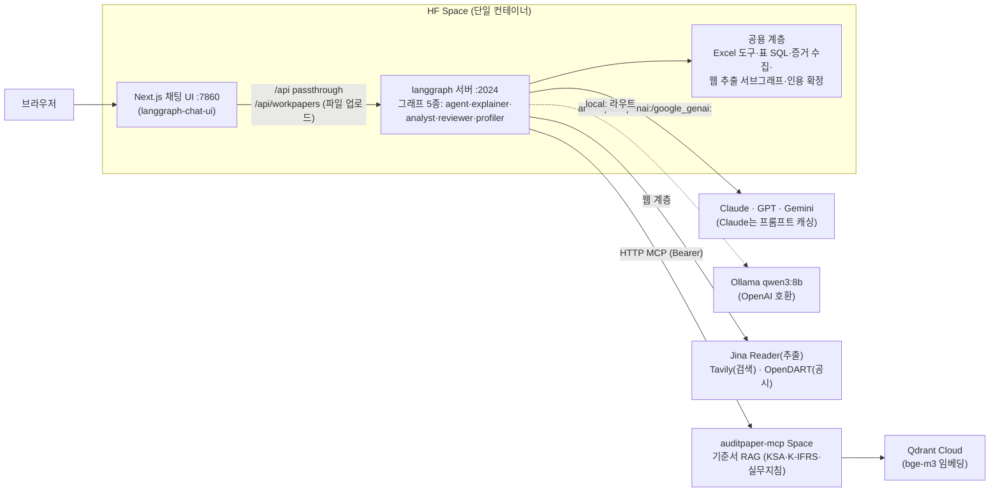

# Agent for Newstep (구 ExcelBrief for Newsteps)

**회계법인 신입(뉴스텝) 회계사를 위한 감사조서 해설 AI 에이전트**

Excel 감사조서를 읽고 한국 회계감사기준(KSA)·K-IFRS·회계감사실무지침에
근거해 설명한다. 범용기 1 + 특화기 4의 **그래프 5종 체제**:

| 그래프 | 하는 일 |
|---|---|
| **All-in-One Agent** | 도구 15종(Excel 판독·표 SQL·문서·기준서 RAG·웹 검색·웹 추출)을 쥔 범용 ReAct — 여러 파일을 넘나드는 질문, 기준서 자체 질문 |
| **조서 해설** | 조서 하나를 정독해 구조·수행 절차를 '경영진 주장 → 위험 → 절차 → 증거' 관점으로 해설 (고정 파이프라인) |
| **대형 엑셀 분석** | 대형 Excel/CSV를 AST 검증 + 격리 DuckDB의 읽기 전용 SQL로 집계·분석 |
| **조서 검토** | 완성도 점검 — 절차 누락·서명 공란·tie-out 이상을 심각도·주장·미해결 위험과 함께 보고 |
| **기업이해** | 감사 착수 전 회사 이해(감사기준서 315) 브리핑 — DART 공시 + 웹 검색·추출로 산업·사업·재무·최근 이슈·유의적 위험 후보 정리 |

모든 기준서 인용은 RAG 도구로 **원문을 확인한 문단만** 사용하며, 보고서
말미에 근거 목록(표기 + cid)을 붙인다. 고정 그래프는 검색어 생성만 LLM이
하고 검색·재확인·인용 확정은 코드가 결정적으로 수행한다.

> **데모**: [HuggingFace Space](https://huggingface.co/spaces/toddl/excelbrief) —
> 링크 하나로 바로 체험 (번들 데이터는 전부 가상 샘플 조서·한공회 공식 빈 서식)

## 아키텍처



- **분리 원칙**: 결정성·비용 상한·출력 형식·안전 관문(SQL AST 검증, SSRF
  방어)처럼 **보장이 필요한 작업만 고정 그래프**로 뺀다 — UI에서 그래프를
  고르는 행위 = 필요한 보장을 고르는 행위
- **모델 라우팅**: 요청 config의 `model` 값으로 벤더 분기 — `anthropic:<id>`(기본) /
  `openai:<id>` / `google_genai:<id>` / `hf:<org/model>`(HF Inference Providers
  라우터, 오픈모델 서버리스) / `local:<name>`(Ollama 등 OpenAI 호환).
  UI 드롭다운은 벤더 API 키가 설정된 모델만 노출(`/api/models`)
- **웹 계층**: 추출은 Jina Reader 1차(JS 렌더링 포함) → httpx+bs4 폴백
  (SSRF 방어: 사설/루프백 IP 차단·리다이렉트 재검증·2MB 상한), 검색은
  Tavily 우선(결과에 본문 발췌 포함) → Jina 폴백, 상장사 재무는 OpenDART
  공식 공시 — 키가 없으면 각 계층이 우아하게 강등된다
- **인용 표기 계층**: MCP 도구 결과의 각 문단 cid(`KIFRS::1115::31`)에 코드가
  한국어 표기(display, "K-IFRS 제1115호 '…' 문단 31")를 주입 — 모델은 배치만 담당
- **API passthrough**: 브라우저는 UI 도메인의 `/api`만 호출, Next 서버가
  내부 langgraph 서버로 중계 (백엔드 포트 비노출)

## 답변 품질 평가

기준서 인용의 재현율(recall)을 채점하는 루프를 돌려 시스템 프롬프트를 개선했다.

- 골드셋: 조서에 명시된 기준서·지침 참조를 스캔해 제작 (`routing_gold.json`)
- 채점: 답변 근거 목록의 cid → 기준서 번호 집합을 골드와 대조 (recall 중심)
- 결과: 한공회 서식 조서 2건(3650 감사 전 재무제표 확인, 3900A 핵심감사사항)
  **recall 1.0** — [해석 보고서](reports/) 참조
- 교훈: "빠뜨리지 말라"는 추상 규칙은 실패, **답변 직전 자가 점검 체크리스트**
  (본문 등장 번호 전수 대조)가 통과 — LangSmith 트레이스 해부로 절단·이중
  트레이싱·캐시 미적용도 함께 잡음

## 기술 스택

| 구분 | 사용 기술 |
|---|---|
| 에이전트 | Python 3.12, LangChain `create_agent`(ReAct) + LangGraph StateGraph 고정 파이프라인 4종, LangGraph 서버 |
| LLM | 멀티 벤더 선택 — Claude(기본, 프롬프트 캐싱 실측 87% 히트) · GPT · Gemini · 오픈모델(HF Inference Providers) · Ollama 로컬(qwen3:8b) |
| 기준서 RAG | FastMCP HTTP 서버([auditPaper_MCP](https://github.com/worldoftoddl/auditPaper_MCP)) + Qdrant + bge-m3 |
| 문서 파싱 | openpyxl(xlsx/xlsm)·xlrd(구형 xls)·python-docx(docx) — 값·수식·서식·메모·숨김·유효성 전 계층 판독 |
| 표 분석 | sqlglot AST 검증 + DuckDB `external_access=false` 2중 격리 읽기 전용 SQL |
| 웹 계층 | Jina Reader(추출, SSRF 방어 폴백 fetcher 내장) · Tavily(검색) · OpenDART(상장사 공시·재무) — 전부 선택 시크릿, 없으면 강등 |
| 파일 업로드 | Next.js `/api/workpapers` → 조서 폴더 저장, 채팅 첨부로 즉시 분석 (xlsx·xlsm·xls·csv·docx, 20MB) |
| UI | Next.js 15 ([langgraph-chat-ui](https://github.com/braincrew-lab/langgraph-chat-ui) 벤더링, standalone 모드) — 그래프 셀렉터·스레드 사이드바·툴 호출 시각화 |
| 관측 | LangSmith 트레이싱 |
| 배포 | HuggingFace Spaces (Docker 단일 컨테이너) |

## 로컬 실행

```bash
# 1. 백엔드 (langgraph 서버 :2024)
python -m venv .venv && .venv/bin/pip install -e ".[dev]"
cp .env.example .env  # ANTHROPIC_API_KEY, MCP_AUTH_TOKEN 등 기입
.venv/bin/python -m langgraph_cli dev --no-browser --host 0.0.0.0

# 2. UI (:3000) — ui/.env에 standalone 모드 + passthrough 구성
#    AUTH_MODE=standalone / NEXT_PUBLIC_AUTH_MODE=standalone
#    NEXT_PUBLIC_API_URL=http://localhost:2024
#    LANGGRAPH_API_URL=http://localhost:2024
#    NEXT_PUBLIC_ASSISTANT_ID=agent / NEXT_PUBLIC_DEFAULT_LOCALE=ko
cd ui && corepack pnpm install && corepack pnpm dev
```

선택 시크릿: `JINA_API_KEY`(웹 추출 고속화·검색 폴백), `TAVILY_API_KEY`
(웹 검색), `DART_API_KEY`(기업이해 공시 수집) — 없어도 해당 기능만 강등되고
나머지는 동작한다.

데모 샘플 조서는 `scripts/make_demo_workpapers.py`로 재생성할 수 있다
(완성 조서 / 미완성 조서 / 범용 Excel — 전부 가상 데이터).

## 프로젝트 구조

```
src/agent/          그래프 5종 (graph·explainer·analyst·reviewer·profiler)
  ├─ tools/           Excel 판독 7종·표 SQL 2종·문서 읽기
  ├─ scraping/        웹 취득 계층 (SSRF 방어·Jina·Tavily·fetcher·청킹)
  ├─ web_extract.py   웹 추출 서브그래프 + agent 도구
  ├─ dart_client.py   OpenDART 경량 클라이언트
  └─ evidence.py 등   증거 수집·인용 확정·공용 계층
ui/                 채팅 UI (langgraph-chat-ui 벤더링 + 그래프 셀렉터·모델 선택·업로드)
data/workpapers/    샘플 조서 (한공회 공식 서식 + 가상 데모 조서 + 더미 CSV)
scripts/            데모 조서 생성기
deploy/hf_space/    HF Space 배포 파일 (README + Dockerfile)
docs/               PRD·아키텍처·시스템 설계·기술 문서·작업 목록
reports/            조서 해석 결과 보고서 (recall 1.0)
tests/              pytest 180건 (그래프·도구·웹 계층·인용·MCP — 네트워크·LLM 무호출)
```

## 주의

- 본 프로젝트는 포트폴리오 MVP다. 번들 데이터는 가상 샘플과 한공회 공식
  빈 서식뿐이며, 실제 피감사회사 데이터를 넣어서는 안 된다.
- 에이전트의 해설은 참고용이며 감사인의 전문가적 판단을 대체하지 않는다.
- 기업이해 브리핑은 공개 웹 자료·공시 기반의 이해 활동 보조 자료이며
  감사증거가 아니다.
