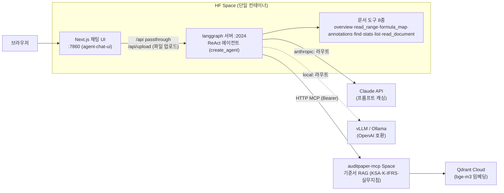

# ExcelBrief for Newsteps

**회계법인 신입(뉴스텝) 회계사를 위한 감사조서 Excel 해설 AI 에이전트**

Excel 감사조서를 읽고 한국 회계감사기준(KSA)·K-IFRS·회계감사실무지침에
근거해 설명한다:

1. 해당 계정·영역에서 **가능한 감사절차**
2. 작성된 조서에서 **어떤 절차가 수행되었는지** 해석 (틱마크·색상 마킹·검토 서명 단서 포함)
3. 미완성 조서에 **추가로 필요한 절차** 제안
4. 감사조서가 아닌 **범용 Excel**도 구조·내용 요약

모든 기준서 인용은 RAG 도구로 **원문을 확인한 문단만** 사용하며, 답변 말미에
근거 목록(표기 + cid)을 붙인다.

> **데모**: [HuggingFace Space](https://huggingface.co/spaces/toddl/excelbrief) —
> 링크 하나로 바로 체험 (번들 데이터는 전부 가상 샘플 조서·한공회 공식 빈 서식)

## 아키텍처



- **모델 라우팅**: 요청 config의 `model` 값으로 `anthropic:<id>`(기본) /
  `local:<name>`(OpenAI 호환 로컬 서버) 분기
- **인용 표기 계층**: MCP 도구 결과의 각 문단 cid(`KIFRS::1115::31`)에 코드가
  한국어 표기(display, "K-IFRS 제1115호 '…' 문단 31")를 주입 — 모델은 배치만 담당
- **API passthrough**: 브라우저는 UI 도메인의 `/api`만 호출, Next 서버가
  내부 langgraph 서버로 중계 (백엔드 포트 비노출)

## 답변 품질 평가

기준서 인용의 재현율(recall)을 채점하는 루프를 돌려 시스템 프롬프트를 개선했다.

- 골드셋: 조서에 명시된 기준서·지침 참조를 스캔해 제작 (`routing_gold.json`)
- 채점: 답변 근거 목록의 cid → 기준서 번호 집합을 골드와 대조 (recall 중심)
- 결과: 한공회 서식 조서 2건(3650 감사 전 재무제표 확인, 3900A 핵심감사사항)
  **recall 1.0** — [해석 보고서](reports/) 참조
- 교훈: "빠뜨리지 말라"는 추상 규칙은 실패, **답변 직전 자가 점검 체크리스트**
  (본문 등장 번호 전수 대조)가 통과 — LangSmith 트레이스 해부로 절단·이중
  트레이싱·캐시 미적용도 함께 잡음

## 기술 스택

| 구분 | 사용 기술 |
|---|---|
| 에이전트 | Python 3.12, LangChain `create_agent`(ReAct), LangGraph 서버 |
| LLM | Claude (프롬프트 캐싱, 실측 87% 캐시 히트) · 로컬 모델 라우트 |
| 기준서 RAG | FastMCP HTTP 서버([auditPaper_MCP](https://github.com/worldoftoddl/auditPaper_MCP)) + Qdrant + bge-m3 |
| 문서 파싱 | openpyxl(xlsx/xlsm)·xlrd(구형 xls)·python-docx(docx) — 값·수식·서식·메모·숨김·유효성 전 계층 판독 |
| 파일 업로드 | Next.js `/api/upload` → 조서 폴더 저장, 채팅 첨부로 즉시 분석 (xlsx·xlsm·xls·docx, 20MB) |
| UI | Next.js 15 ([agent-chat-ui](https://github.com/braincrew-lab/agent-chat-ui) 벤더링) |
| 관측 | LangSmith 트레이싱 |
| 배포 | HuggingFace Spaces (Docker 단일 컨테이너) |

## 로컬 실행

```bash
# 1. 백엔드 (langgraph 서버 :2024)
python -m venv .venv && .venv/bin/pip install -e ".[dev]"
cp .env.example .env  # ANTHROPIC_API_KEY, MCP_AUTH_TOKEN 등 기입
.venv/bin/python -m langgraph_cli dev --no-browser --host 0.0.0.0

# 2. UI (:3000) — ui/.env에 passthrough 구성
#    NEXT_PUBLIC_API_URL=http://localhost:3000/api
#    NEXT_PUBLIC_ASSISTANT_ID=agent
#    LANGGRAPH_API_URL=http://localhost:2024
cd ui && corepack pnpm install && corepack pnpm dev
```

데모 샘플 조서는 `scripts/make_demo_workpapers.py`로 재생성할 수 있다
(완성 조서 / 미완성 조서 / 범용 Excel — 전부 가상 데이터).

## 프로젝트 구조

```
src/agent/          에이전트 (graph.py 진입점, 도구, 프롬프트, 인용 표기 계층)
ui/                 채팅 UI (agent-chat-ui 벤더링 + 브랜딩)
data/workpapers/    샘플 조서 (한공회 공식 서식 + 가상 데모 조서)
scripts/            데모 조서 생성기
deploy/hf_space/    HF Space 배포 파일 (README + Dockerfile)
docs/               PRD·아키텍처·시스템 설계·기술 문서·작업 목록
reports/            조서 해석 결과 보고서 (recall 1.0)
tests/              pytest 49건 (인용 표기·Excel 도구·MCP·스모크)
```

## 주의

- 본 프로젝트는 포트폴리오 MVP다. 번들 데이터는 가상 샘플과 한공회 공식
  빈 서식뿐이며, 실제 피감사회사 데이터를 넣어서는 안 된다.
- 에이전트의 해설은 참고용이며 감사인의 전문가적 판단을 대체하지 않는다.
