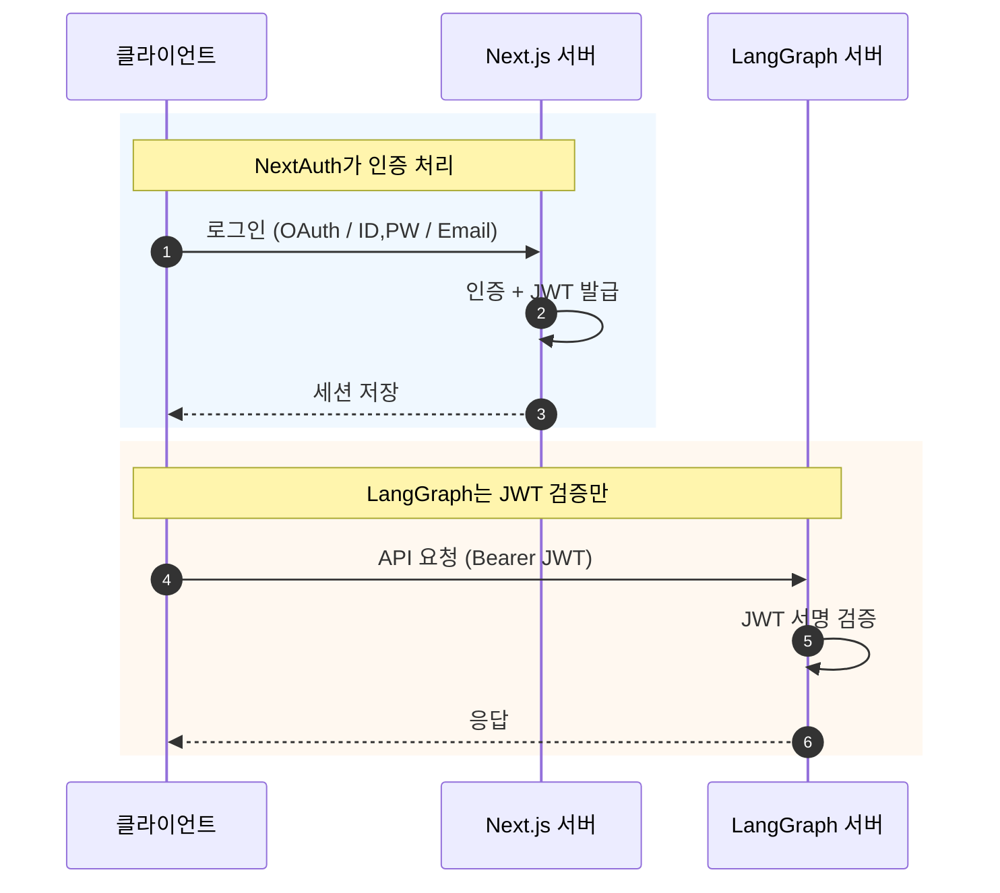
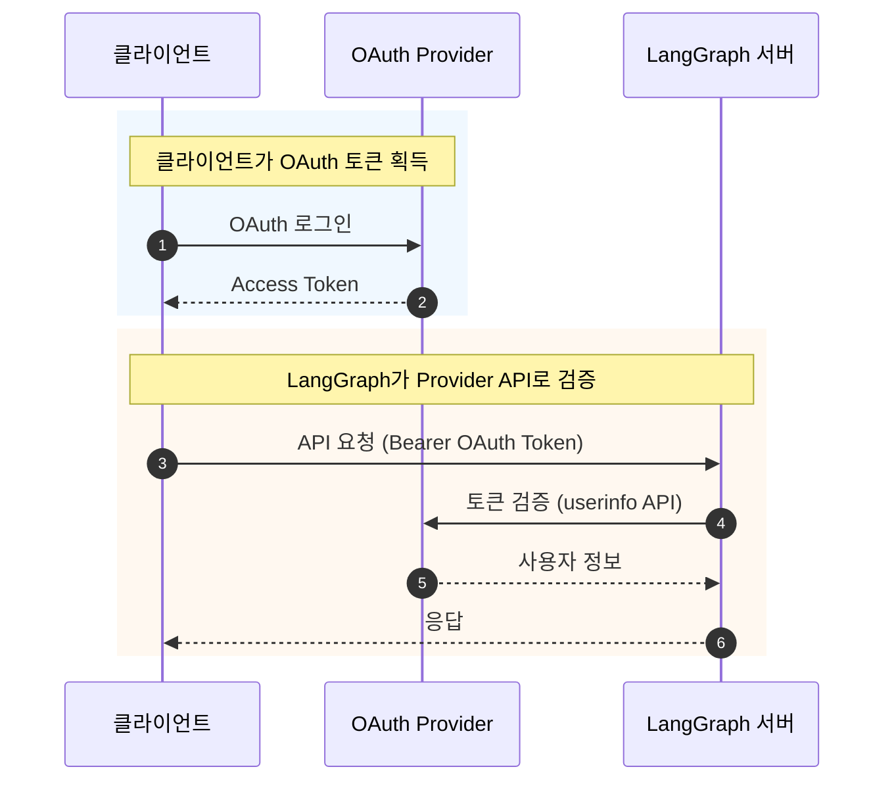
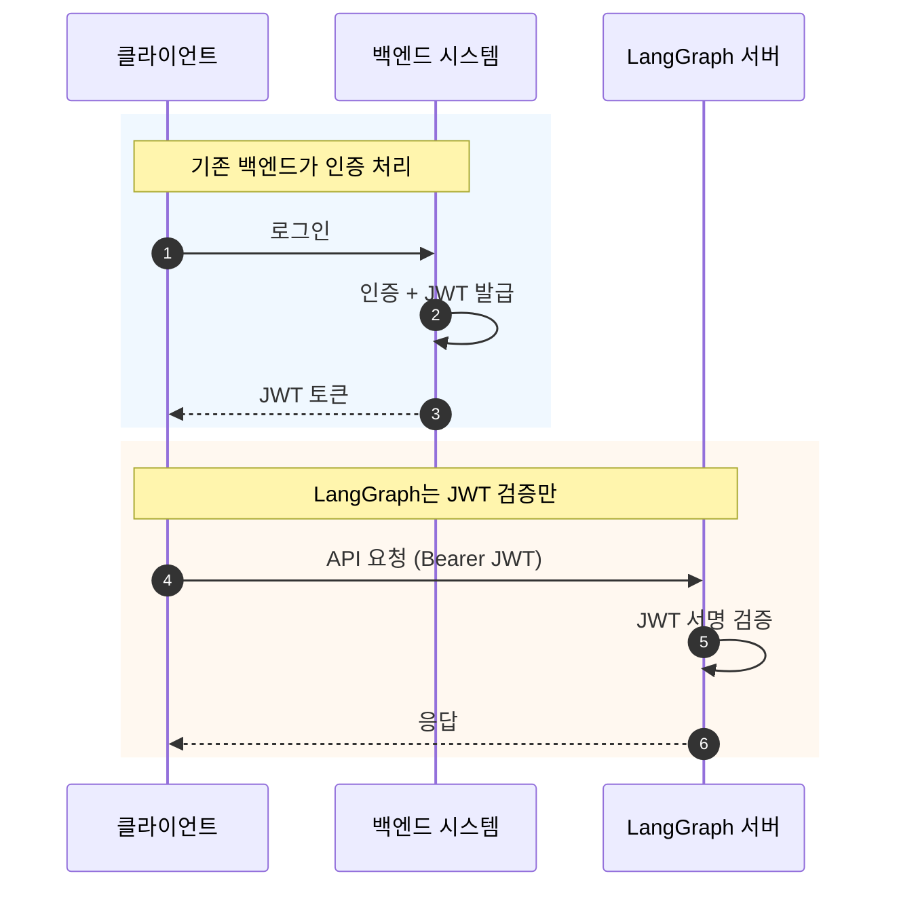
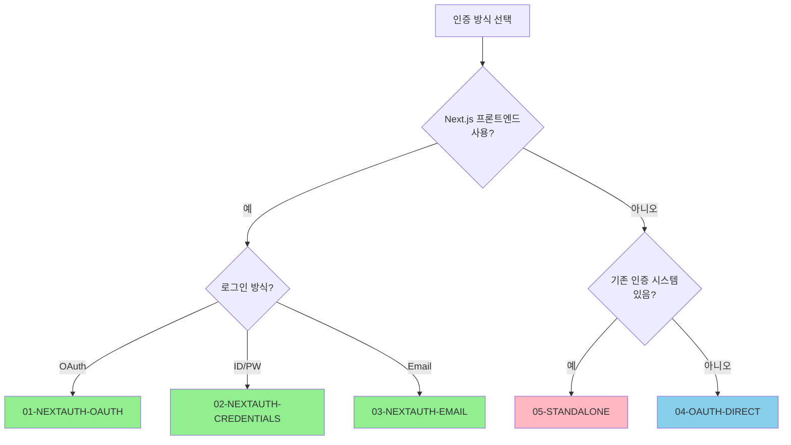

# LangGraph 인증 가이드

LangGraph 백엔드와 프론트엔드 연동 시 인증 설정 방법을 안내합니다.

## 문서 구조

| 문서                                                           | 설명                                 |
| -------------------------------------------------------------- | ------------------------------------ |
| [01-NEXTAUTH-OAUTH.md](./01-NEXTAUTH-OAUTH.ko.md)                 | NextAuth + OAuth (Google, GitHub 등) |
| [02-NEXTAUTH-CREDENTIALS.md](./02-NEXTAUTH-CREDENTIALS.ko.md)     | NextAuth + ID/PW 로그인              |
| [03-NEXTAUTH-EMAIL.md](./03-NEXTAUTH-EMAIL.ko.md)                 | NextAuth + Email (Magic Link)        |
| [04-OAUTH-DIRECT.md](./04-OAUTH-DIRECT.ko.md)                     | OAuth 토큰 직접 검증 (NextAuth 없이) |
| [05-STANDALONE.md](./05-STANDALONE.ko.md)                         | 백엔드 자체 인증 시스템 연동         |

---

## 인증 방식 비교

### NextAuth 사용 (01, 02, 03)



**특징:**

- Next.js 프론트엔드 필요
- NextAuth가 JWT 발급
- LangGraph는 서명만 검증 (DB 불필요)

### OAuth 직접 검증 (04)



**특징:**

- 프론트엔드 불필요 (CLI, 모바일 등)
- 매 요청마다 Provider API 호출
- Rate Limit 주의

### 자체 인증 연동 (05)



**특징:**

- 기존 인증 시스템이 있는 경우
- JWT Secret만 공유하면 연동 가능
- LangGraph는 검증만 담당

---

## 의사결정 가이드



---

## LangGraph 공통 설정

모든 방식에서 LangGraph 측 설정은 동일합니다:

### langgraph.json

```json
{
  "auth": {
    "path": "src/security/auth.py:auth"
  }
}
```

### src/security/auth.py

```python
import os
import jwt
from langgraph_sdk import Auth

JWT_SECRET_KEY = os.environ.get("JWT_SECRET_KEY", "")
JWT_ALGORITHM = "HS256"

auth = Auth()


@auth.authenticate
async def authenticate(authorization: str | None) -> Auth.types.MinimalUserDict:
    """JWT 토큰 검증"""
    if not authorization:
        raise Auth.exceptions.HTTPException(status_code=401, detail="Unauthorized")

    scheme, _, token = authorization.partition(" ")
    if scheme.lower() != "bearer" or not token:
        raise Auth.exceptions.HTTPException(status_code=401, detail="Invalid token")

    try:
        payload = jwt.decode(token, JWT_SECRET_KEY, algorithms=[JWT_ALGORITHM])
    except jwt.InvalidTokenError:
        raise Auth.exceptions.HTTPException(status_code=401, detail="Invalid token")

    return {
        "identity": payload.get("sub"),
        "email": payload.get("email", ""),
    }


@auth.on
async def filter_by_owner(ctx: Auth.types.AuthContext, value: dict) -> dict:
    """사용자별 스레드 격리"""
    metadata = value.setdefault("metadata", {})
    metadata["owner"] = ctx.user.identity
    return {"owner": ctx.user.identity}
```

### 환경 변수

```env
JWT_SECRET_KEY=your-shared-jwt-secret
```

**중요**: `JWT_SECRET_KEY`는 토큰을 발급하는 쪽(NextAuth, 백엔드 등)과 동일해야 합니다.

---

## 참고 자료

- [LangGraph Authentication Docs](https://langchain-ai.github.io/langgraph/cloud/concepts/auth/)
- [NextAuth.js Documentation](https://next-auth.js.org/)
- [OAuth 2.0 Specification](https://oauth.net/2/)
