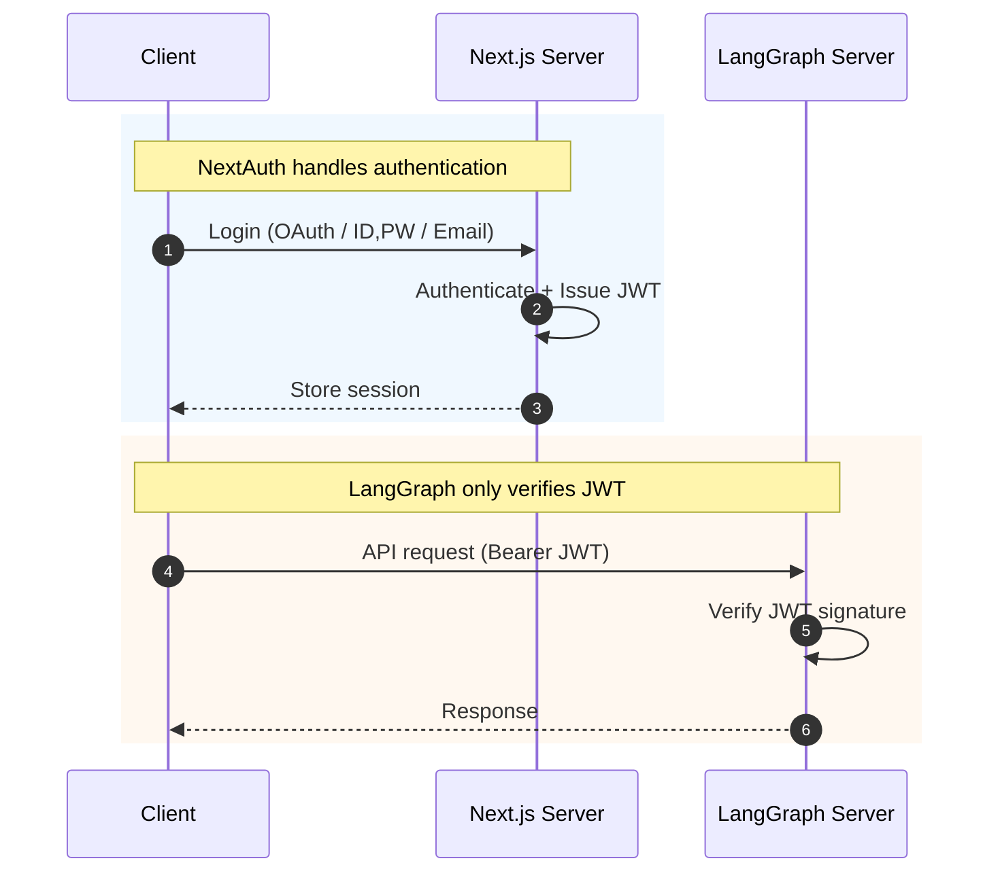
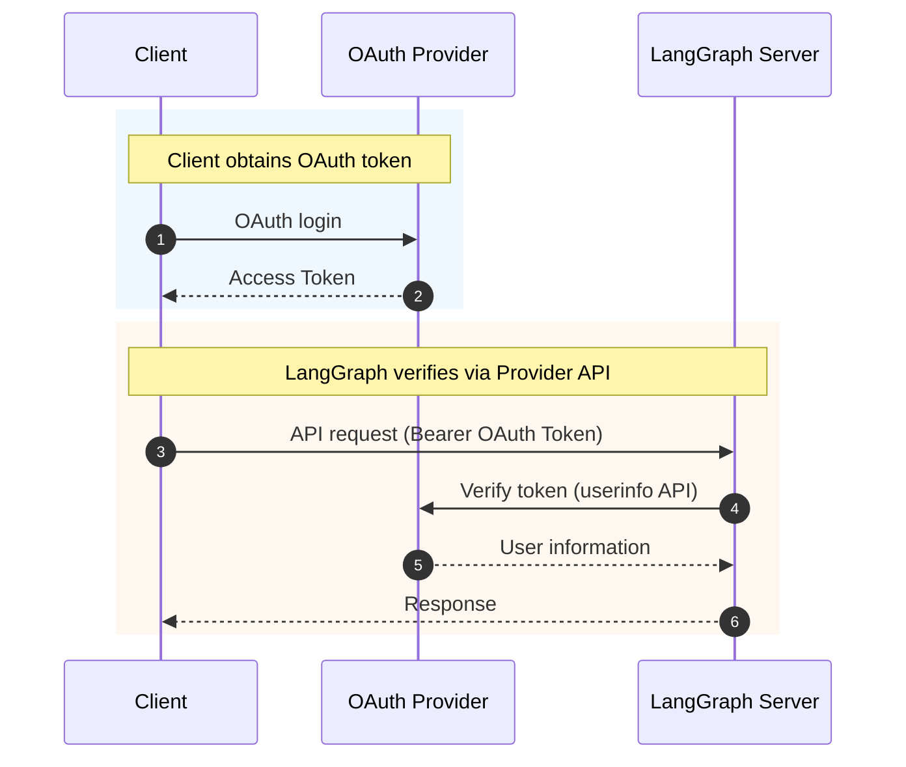
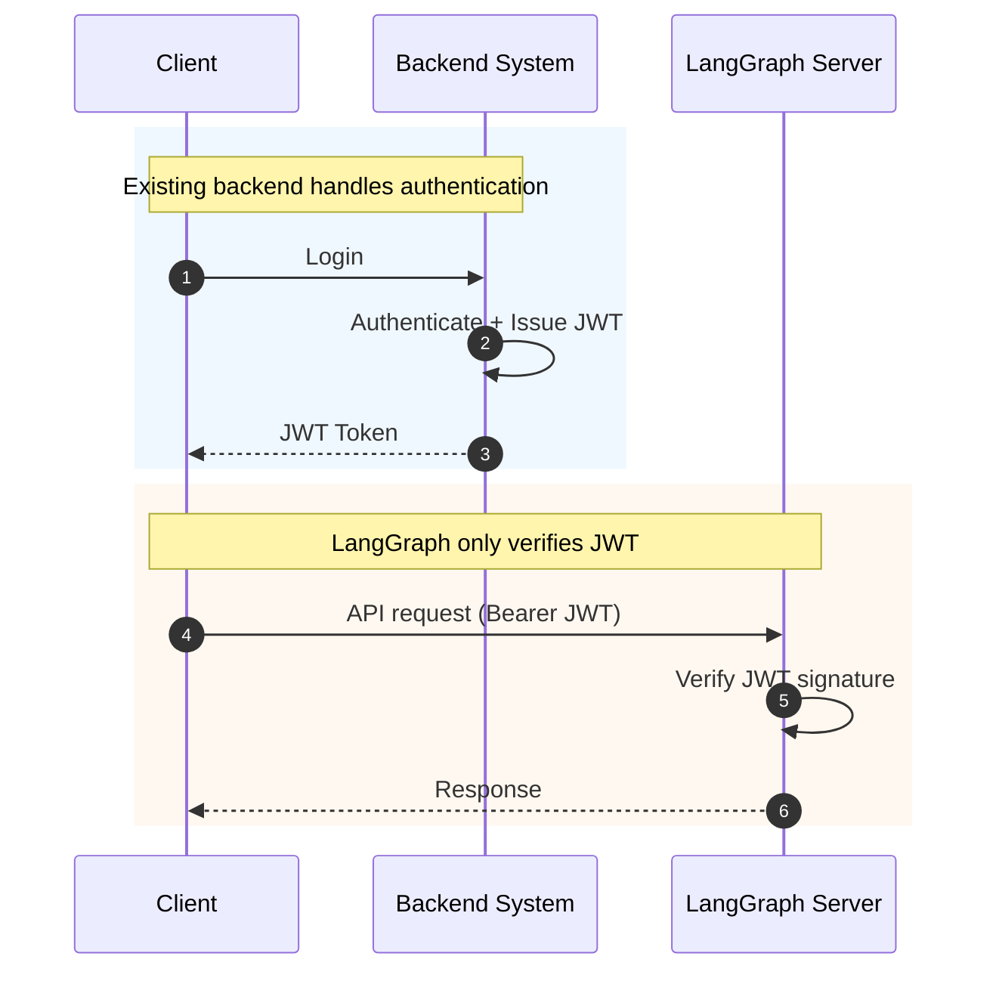
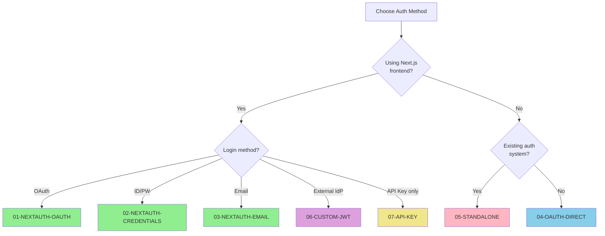

# LangGraph Authentication Guide

This guide explains how to set up authentication when integrating LangGraph backend with your frontend.

## Document Structure

| Document                                                       | Description                              |
| -------------------------------------------------------------- | ---------------------------------------- |
| [01-NEXTAUTH-OAUTH.md](./01-NEXTAUTH-OAUTH.md)                 | NextAuth + OAuth (Google, GitHub, etc.)  |
| [02-NEXTAUTH-CREDENTIALS.md](./02-NEXTAUTH-CREDENTIALS.md)     | NextAuth + ID/PW Login                   |
| [03-NEXTAUTH-EMAIL.md](./03-NEXTAUTH-EMAIL.md)                 | NextAuth + Email (Magic Link)            |
| [04-OAUTH-DIRECT.md](./04-OAUTH-DIRECT.md)                     | Direct OAuth Token Verification (without NextAuth) |
| [05-STANDALONE.md](./05-STANDALONE.md)                         | Integration with Backend's Own Auth System |
| [06-CUSTOM-JWT.md](./06-CUSTOM-JWT.md)                         | External IdP + JWKS Validation (Keycloak, Auth0, etc.) |
| [07-API-KEY.md](./07-API-KEY.md)                               | API Key Authentication (LangGraph Cloud) |
| [08-CUSTOM-SERVER-AUTH.md](./08-CUSTOM-SERVER-AUTH.md)           | Tutorial: Your First Custom LangGraph Server Auth |

---

## Authentication Method Comparison

### Using NextAuth (01, 02, 03)



**Characteristics:**

- Requires a Next.js frontend
- NextAuth issues the JWT
- LangGraph only verifies the signature (no DB required)

### Direct OAuth Verification (04)



**Characteristics:**

- No frontend required (CLI, mobile, etc.)
- Calls Provider API on every request
- Watch out for Rate Limits

### Standalone Auth Integration (05)



**Characteristics:**

- For cases where an existing auth system is in place
- Integration possible by sharing only the JWT Secret
- LangGraph is responsible for verification only

---

## Decision Guide



---

## LangGraph Common Configuration

The LangGraph-side configuration is the same across all methods:

### langgraph.json

```json
{
  "auth": {
    "path": "src/security/auth.py:auth"
  }
}
```

### src/security/auth.py

```python
import os
import jwt
from langgraph_sdk import Auth

JWT_SECRET_KEY = os.environ.get("JWT_SECRET_KEY", "")
JWT_ALGORITHM = "HS256"

auth = Auth()


@auth.authenticate
async def authenticate(authorization: str | None) -> Auth.types.MinimalUserDict:
    """Verify JWT token"""
    if not authorization:
        raise Auth.exceptions.HTTPException(status_code=401, detail="Unauthorized")

    scheme, _, token = authorization.partition(" ")
    if scheme.lower() != "bearer" or not token:
        raise Auth.exceptions.HTTPException(status_code=401, detail="Invalid token")

    try:
        payload = jwt.decode(token, JWT_SECRET_KEY, algorithms=[JWT_ALGORITHM])
    except jwt.InvalidTokenError:
        raise Auth.exceptions.HTTPException(status_code=401, detail="Invalid token")

    return {
        "identity": payload.get("sub"),
        "email": payload.get("email", ""),
    }


@auth.on
async def filter_by_owner(ctx: Auth.types.AuthContext, value: dict) -> dict:
    """Isolate threads per user"""
    metadata = value.setdefault("metadata", {})
    metadata["owner"] = ctx.user.identity
    return {"owner": ctx.user.identity}
```

### Environment Variables

```env
JWT_SECRET_KEY=your-shared-jwt-secret
```

**Important**: `JWT_SECRET_KEY` must be the same as the one used by the token issuer (NextAuth, backend, etc.).

---

## References

- [LangGraph Authentication Docs](https://langchain-ai.github.io/langgraph/cloud/concepts/auth/)
- [NextAuth.js Documentation](https://next-auth.js.org/)
- [OAuth 2.0 Specification](https://oauth.net/2/)
