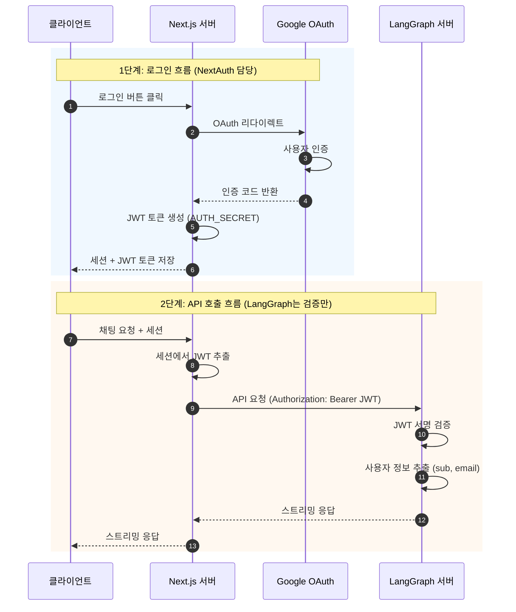
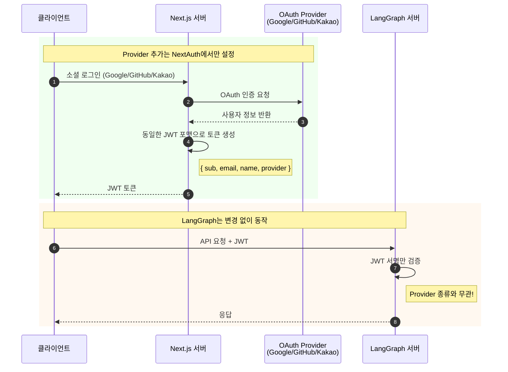
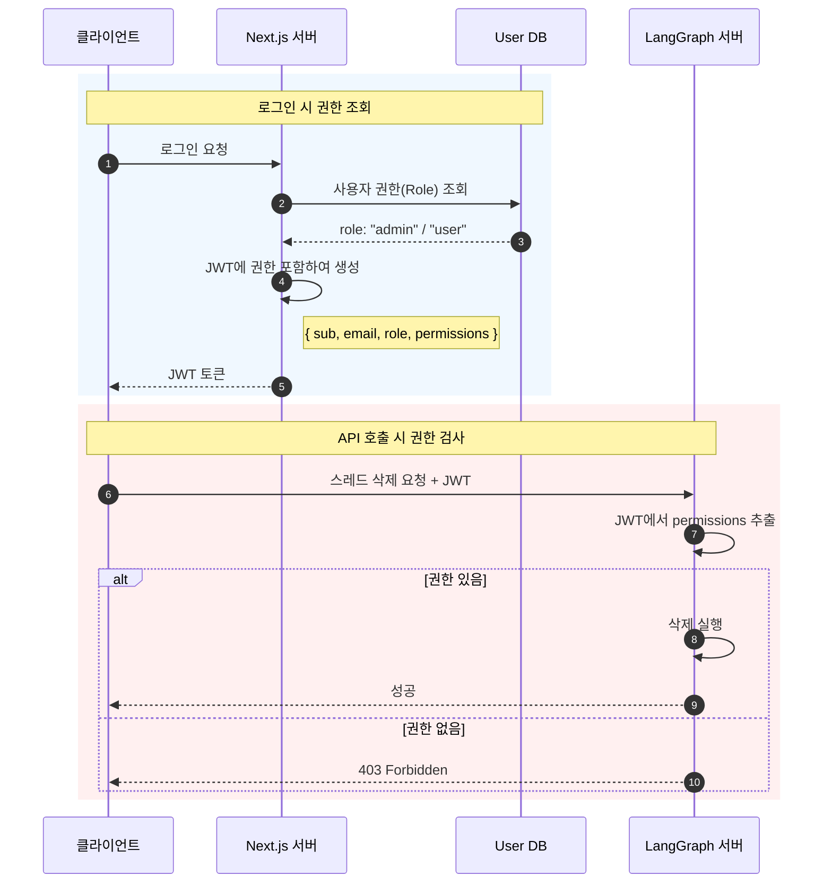
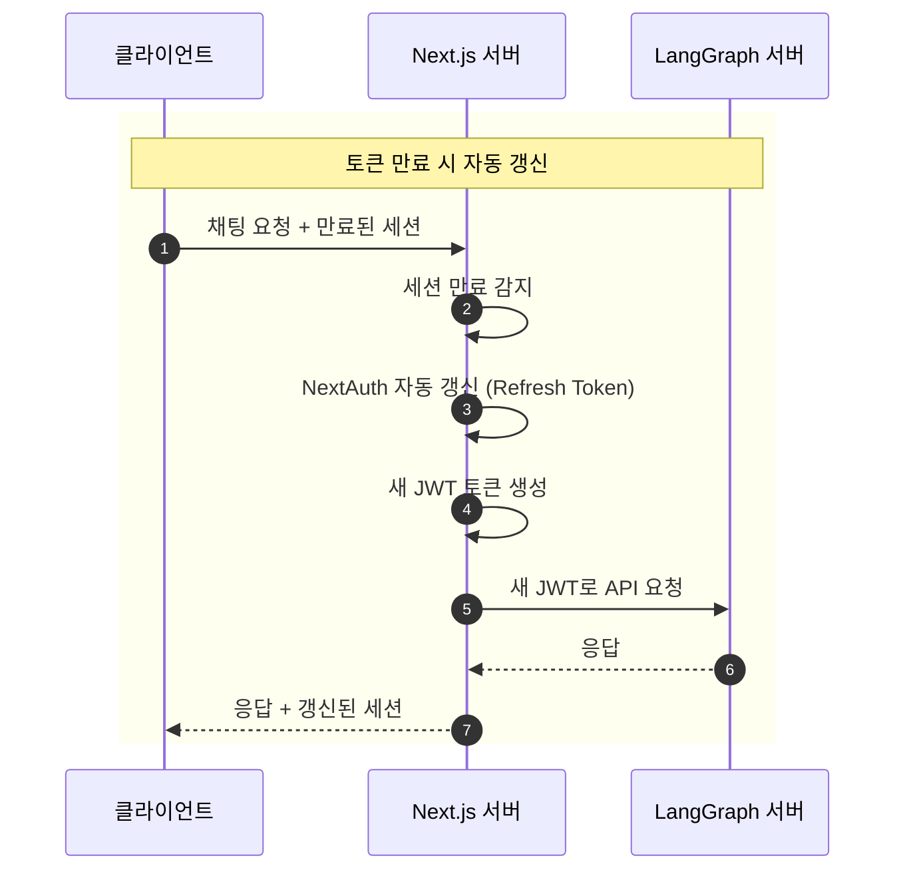

# NextAuth OAuth 인증

NextAuth의 OAuth Provider(Google, GitHub 등)를 사용하여 소셜 로그인을 처리하고, LangGraph 서버에서 JWT를 검증하는 방식입니다.

## 목차

1. [아키텍처 개요](#아키텍처-개요)
2. [장단점](#장단점)
3. [구현 가이드](#구현-가이드)
4. [OAuth Provider 추가](#oauth-provider-추가)
5. [고급 설정](#고급-설정)

---

## 아키텍처 개요



### 역할 분리

| 컴포넌트      | 역할                                        |
| ------------- | ------------------------------------------- |
| **NextAuth**  | 로그인 UI, OAuth 흐름, 토큰 발급, 세션 관리 |
| **LangGraph** | 토큰 검증, 사용자별 리소스 격리, Agent 실행 |

---

## 장단점

### 장점

- **구현 간단**: LangGraph는 검증 로직만 필요
- **NextAuth 생태계 활용**: 50+ OAuth Provider 지원
- **관심사 분리**: 인증은 프론트, 비즈니스는 백엔드
- **SSR 지원**: Next.js 서버 컴포넌트와 자연스럽게 통합

### 단점

- **프론트엔드 의존**: Next.js 없이는 사용 불가
- **토큰 동기화**: JWT Secret 공유 필요
- **제한된 유연성**: NextAuth 설정에 종속

---

## 구현 가이드

### 1. Next.js 측 (NextAuth 설정)

#### 설치

```bash
npm install next-auth
```

#### NextAuth 설정 (`app/api/auth/[...nextauth]/route.ts`)

```typescript
import NextAuth from "next-auth";
import GoogleProvider from "next-auth/providers/google";
import GitHubProvider from "next-auth/providers/github";
import jwt from "jsonwebtoken";

const JWT_SECRET = process.env.JWT_SECRET_KEY!;

export const authOptions = {
  providers: [
    GoogleProvider({
      clientId: process.env.GOOGLE_CLIENT_ID!,
      clientSecret: process.env.GOOGLE_CLIENT_SECRET!,
    }),
    GitHubProvider({
      clientId: process.env.GITHUB_CLIENT_ID!,
      clientSecret: process.env.GITHUB_CLIENT_SECRET!,
    }),
  ],
  callbacks: {
    async jwt({ token, account, profile }) {
      // 첫 로그인 시 추가 정보 저장
      if (account && profile) {
        token.provider = account.provider;
        token.providerAccountId = account.providerAccountId;
      }
      return token;
    },
    async session({ session, token }) {
      // LangGraph용 커스텀 JWT 생성
      const langgraphToken = jwt.sign(
        {
          sub: token.sub,
          email: token.email,
          name: token.name,
          provider: token.provider,
        },
        JWT_SECRET,
        { expiresIn: "1h" },
      );

      session.langgraphToken = langgraphToken;
      session.user.id = token.sub;
      return session;
    },
  },
  secret: JWT_SECRET,
};

const handler = NextAuth(authOptions);
export { handler as GET, handler as POST };
```

#### 타입 확장 (`types/next-auth.d.ts`)

```typescript
import "next-auth";

declare module "next-auth" {
  interface Session {
    langgraphToken?: string;
    user: {
      id?: string;
      name?: string | null;
      email?: string | null;
      image?: string | null;
    };
  }
}
```

#### 환경 변수 (`.env.local`)

```env
# NextAuth
NEXTAUTH_URL=http://localhost:3000
NEXTAUTH_SECRET=your-nextauth-secret

# JWT (LangGraph와 공유)
JWT_SECRET_KEY=your-shared-jwt-secret

# OAuth Providers
GOOGLE_CLIENT_ID=xxx
GOOGLE_CLIENT_SECRET=xxx
GITHUB_CLIENT_ID=xxx
GITHUB_CLIENT_SECRET=xxx
```

### 2. LangGraph 측 (JWT 검증)

#### 환경 변수 (`.env`)

```env
# NextAuth와 동일한 시크릿 사용
JWT_SECRET_KEY=your-shared-jwt-secret
```

#### 인증 핸들러 (`src/security/auth.py`)

```python
import os
import jwt
from langgraph_sdk import Auth

JWT_SECRET_KEY = os.environ.get("JWT_SECRET_KEY", "")
JWT_ALGORITHM = "HS256"

auth = Auth()


@auth.authenticate
async def authenticate(authorization: str | None) -> Auth.types.MinimalUserDict:
    """NextAuth에서 발급한 JWT 토큰 검증"""
    if not authorization:
        raise Auth.exceptions.HTTPException(
            status_code=401,
            detail="Authorization header required"
        )

    scheme, _, token = authorization.partition(" ")
    if scheme.lower() != "bearer" or not token:
        raise Auth.exceptions.HTTPException(
            status_code=401,
            detail="Invalid authorization scheme"
        )

    try:
        payload = jwt.decode(
            token,
            JWT_SECRET_KEY,
            algorithms=[JWT_ALGORITHM]
        )
    except jwt.ExpiredSignatureError:
        raise Auth.exceptions.HTTPException(
            status_code=401,
            detail="Token expired"
        )
    except jwt.InvalidTokenError:
        raise Auth.exceptions.HTTPException(
            status_code=401,
            detail="Invalid token"
        )

    return {
        "identity": payload.get("sub"),
        "email": payload.get("email", ""),
        "name": payload.get("name", ""),
        "provider": payload.get("provider", ""),
    }


@auth.on
async def filter_by_owner(ctx: Auth.types.AuthContext, value: dict) -> dict:
    """사용자별 스레드 격리"""
    metadata = value.setdefault("metadata", {})
    metadata["owner"] = ctx.user.identity
    return {"owner": ctx.user.identity}
```

### 3. 프론트엔드에서 API 호출

```typescript
"use client";
import { useSession } from "next-auth/react";

export function ChatComponent() {
  const { data: session } = useSession();

  const sendMessage = async (message: string) => {
    const response = await fetch("http://localhost:2024/runs", {
      method: "POST",
      headers: {
        "Content-Type": "application/json",
        Authorization: `Bearer ${session?.langgraphToken}`,
      },
      body: JSON.stringify({
        assistant_id: "agent",
        input: { messages: [{ role: "user", content: message }] },
      }),
    });

    return response.json();
  };

  // ...
}
```

---

## OAuth Provider 추가

NextAuth에서 Provider를 추가하면 LangGraph 변경 없이 자동으로 지원됩니다.



### Google OAuth 추가

```typescript
// app/api/auth/[...nextauth]/route.ts
import GoogleProvider from "next-auth/providers/google";

providers: [
  GoogleProvider({
    clientId: process.env.GOOGLE_CLIENT_ID!,
    clientSecret: process.env.GOOGLE_CLIENT_SECRET!,
  }),
];
```

### GitHub OAuth 추가

```typescript
import GitHubProvider from "next-auth/providers/github";

providers: [
  GitHubProvider({
    clientId: process.env.GITHUB_CLIENT_ID!,
    clientSecret: process.env.GITHUB_CLIENT_SECRET!,
  }),
];
```

### Kakao OAuth 추가

```typescript
import KakaoProvider from "next-auth/providers/kakao";

providers: [
  KakaoProvider({
    clientId: process.env.KAKAO_CLIENT_ID!,
    clientSecret: process.env.KAKAO_CLIENT_SECRET!,
  }),
];
```

### 커스텀 OIDC Provider

```typescript
providers: [
  {
    id: "my-oidc",
    name: "My Company SSO",
    type: "oidc",
    issuer: "https://sso.mycompany.com",
    clientId: process.env.OIDC_CLIENT_ID!,
    clientSecret: process.env.OIDC_CLIENT_SECRET!,
  },
];
```

---

## 고급 설정

### 토큰에 권한(Role) 추가



#### NextAuth 측

```typescript
callbacks: {
  async jwt({ token, account, profile }) {
    if (account) {
      // DB에서 사용자 권한 조회
      const userRole = await getUserRole(token.email)
      token.role = userRole
    }
    return token
  },
  async session({ session, token }) {
    const langgraphToken = jwt.sign(
      {
        sub: token.sub,
        email: token.email,
        role: token.role,  // 권한 포함
        permissions: getRolePermissions(token.role),
      },
      JWT_SECRET,
      { expiresIn: "1h" }
    )
    session.langgraphToken = langgraphToken
    return session
  },
}
```

#### LangGraph 측 (권한 검사)

```python
@auth.authenticate
async def authenticate(authorization: str | None) -> Auth.types.MinimalUserDict:
    # ... 토큰 검증

    return {
        "identity": payload.get("sub"),
        "role": payload.get("role", "user"),
        "permissions": payload.get("permissions", []),
    }


@auth.on.threads.create
async def check_create_permission(ctx: Auth.types.AuthContext, value: dict):
    """생성 권한 검사"""
    if "create" not in ctx.user.get("permissions", []):
        raise Auth.exceptions.HTTPException(
            status_code=403,
            detail="Permission denied"
        )

    metadata = value.setdefault("metadata", {})
    metadata["owner"] = ctx.user.identity
    return {"owner": ctx.user.identity}
```

### 토큰 갱신 처리



```typescript
// lib/langgraph-client.ts
export async function fetchWithAuth(url: string, options: RequestInit = {}) {
  const session = await getServerSession(authOptions);

  if (!session?.langgraphToken) {
    throw new Error("Not authenticated");
  }

  // 토큰 만료 체크 (클라이언트 측)
  const payload = JSON.parse(atob(session.langgraphToken.split(".")[1]));
  if (payload.exp * 1000 < Date.now()) {
    // 세션 갱신 필요
    throw new Error("Token expired, please refresh session");
  }

  return fetch(url, {
    ...options,
    headers: {
      ...options.headers,
      Authorization: `Bearer ${session.langgraphToken}`,
    },
  });
}
```

---

## 체크리스트

- [ ] NextAuth 설정 완료
- [ ] JWT_SECRET_KEY 양쪽 동일하게 설정
- [ ] OAuth Provider 콘솔에서 Redirect URI 등록
- [ ] LangGraph auth.py 구현
- [ ] langgraph.json에 auth 경로 설정
- [ ] 프론트엔드에서 토큰 포함하여 API 호출
- [ ] 토큰 만료 처리 구현

---

## 다음 단계

- ID/PW 로그인 추가: [02-NEXTAUTH-CREDENTIALS.md](./02-NEXTAUTH-CREDENTIALS.ko.md)
- Email 인증 추가: [03-NEXTAUTH-EMAIL.md](./03-NEXTAUTH-EMAIL.ko.md)
- OAuth 토큰 직접 검증: [04-OAUTH-DIRECT.md](./04-OAUTH-DIRECT.ko.md)
