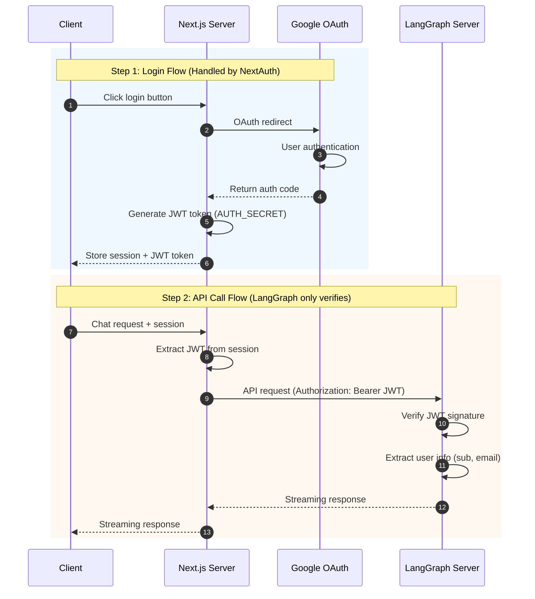
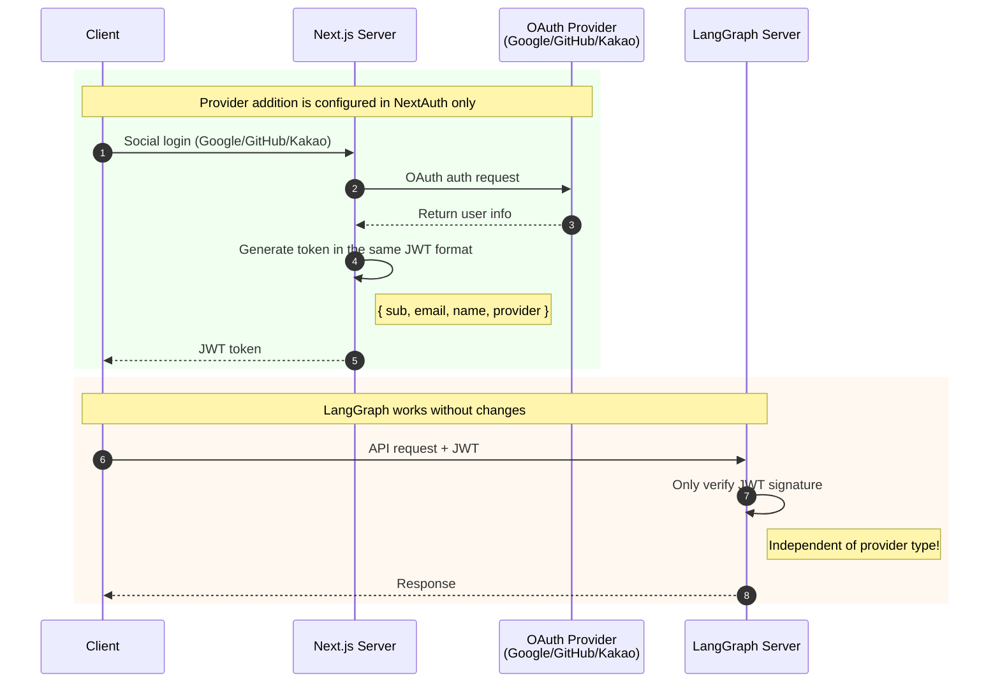
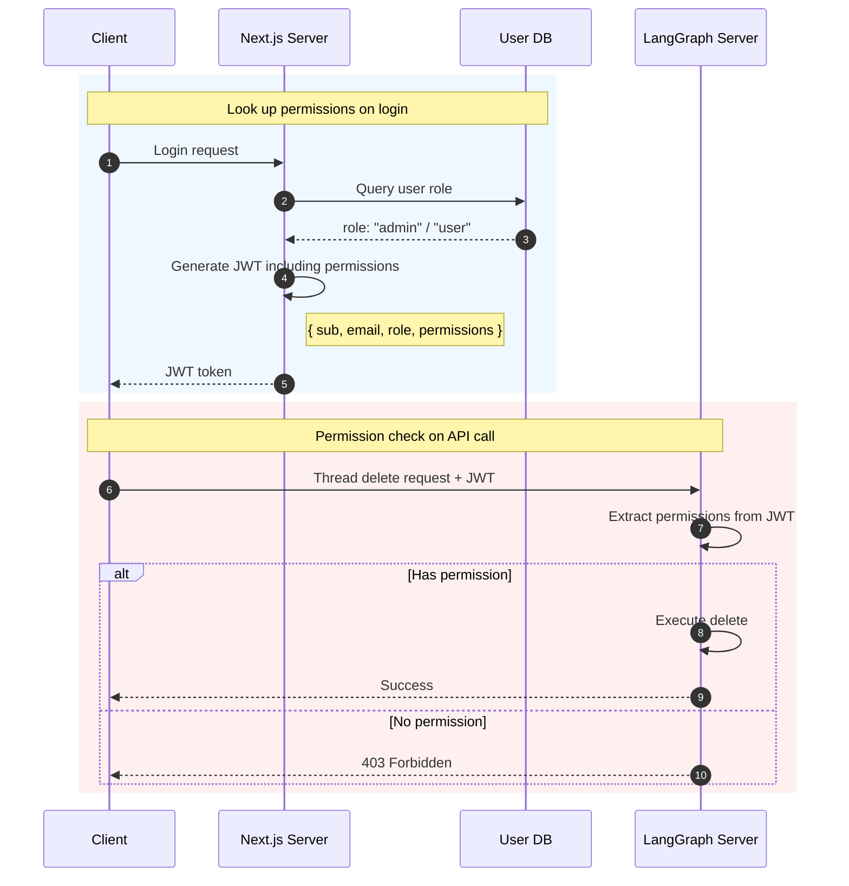
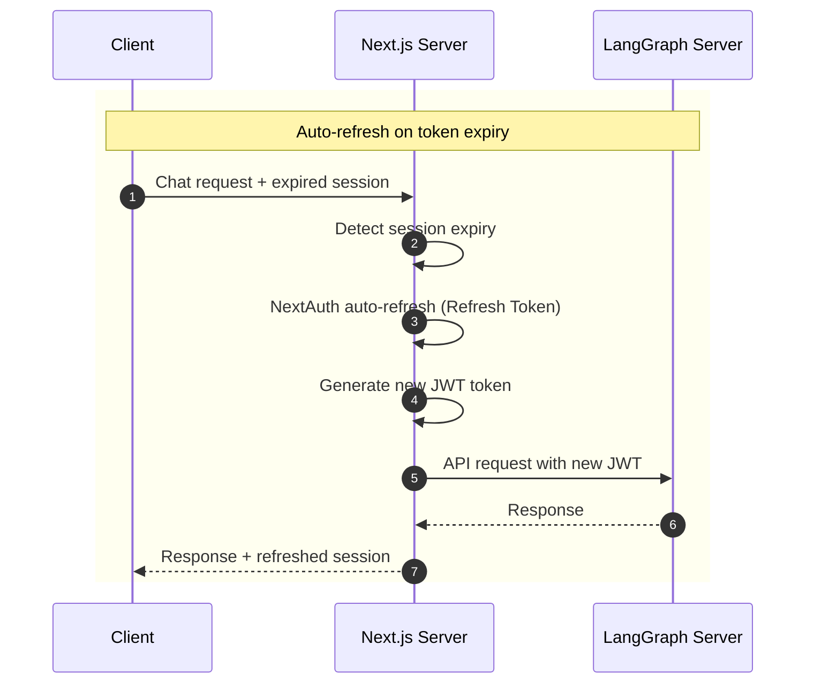

# NextAuth OAuth Authentication

This approach uses NextAuth's OAuth Providers (Google, GitHub, etc.) to handle social login and verifies the JWT on the LangGraph server.

## Table of Contents

1. [Architecture Overview](#architecture-overview)
2. [Pros and Cons](#pros-and-cons)
3. [Implementation Guide](#implementation-guide)
4. [Adding OAuth Providers](#adding-oauth-providers)
5. [Advanced Configuration](#advanced-configuration)

---

## Architecture Overview



### Separation of Concerns

| Component     | Role                                              |
| ------------- | ------------------------------------------------- |
| **NextAuth**  | Login UI, OAuth flow, token issuance, session management |
| **LangGraph** | Token verification, per-user resource isolation, Agent execution |

---

## Pros and Cons

### Pros

- **Simple implementation**: LangGraph only needs verification logic
- **NextAuth ecosystem**: Supports 50+ OAuth Providers
- **Separation of concerns**: Auth on frontend, business logic on backend
- **SSR support**: Integrates naturally with Next.js server components

### Cons

- **Frontend dependency**: Cannot be used without Next.js
- **Token synchronization**: Requires shared JWT Secret
- **Limited flexibility**: Dependent on NextAuth configuration

---

## Implementation Guide

### 1. Next.js Side (NextAuth Configuration)

#### Installation

```bash
npm install next-auth
```

#### NextAuth Configuration (`app/api/auth/[...nextauth]/route.ts`)

```typescript
import NextAuth from "next-auth";
import GoogleProvider from "next-auth/providers/google";
import GitHubProvider from "next-auth/providers/github";
import jwt from "jsonwebtoken";

const JWT_SECRET = process.env.JWT_SECRET_KEY!;

export const authOptions = {
  providers: [
    GoogleProvider({
      clientId: process.env.GOOGLE_CLIENT_ID!,
      clientSecret: process.env.GOOGLE_CLIENT_SECRET!,
    }),
    GitHubProvider({
      clientId: process.env.GITHUB_CLIENT_ID!,
      clientSecret: process.env.GITHUB_CLIENT_SECRET!,
    }),
  ],
  callbacks: {
    async jwt({ token, account, profile }) {
      // Store additional info on first login
      if (account && profile) {
        token.provider = account.provider;
        token.providerAccountId = account.providerAccountId;
      }
      return token;
    },
    async session({ session, token }) {
      // Generate custom JWT for LangGraph
      const langgraphToken = jwt.sign(
        {
          sub: token.sub,
          email: token.email,
          name: token.name,
          provider: token.provider,
        },
        JWT_SECRET,
        { expiresIn: "1h" },
      );

      session.langgraphToken = langgraphToken;
      session.user.id = token.sub;
      return session;
    },
  },
  secret: JWT_SECRET,
};

const handler = NextAuth(authOptions);
export { handler as GET, handler as POST };
```

#### Type Extension (`types/next-auth.d.ts`)

```typescript
import "next-auth";

declare module "next-auth" {
  interface Session {
    langgraphToken?: string;
    user: {
      id?: string;
      name?: string | null;
      email?: string | null;
      image?: string | null;
    };
  }
}
```

#### Environment Variables (`.env.local`)

```env
# NextAuth
NEXTAUTH_URL=http://localhost:3000
NEXTAUTH_SECRET=your-nextauth-secret

# JWT (shared with LangGraph)
JWT_SECRET_KEY=your-shared-jwt-secret

# OAuth Providers
GOOGLE_CLIENT_ID=xxx
GOOGLE_CLIENT_SECRET=xxx
GITHUB_CLIENT_ID=xxx
GITHUB_CLIENT_SECRET=xxx
```

### 2. LangGraph Side (JWT Verification)

#### Environment Variables (`.env`)

```env
# Use the same secret as NextAuth
JWT_SECRET_KEY=your-shared-jwt-secret
```

#### Auth Handler (`src/security/auth.py`)

```python
import os
import jwt
from langgraph_sdk import Auth

JWT_SECRET_KEY = os.environ.get("JWT_SECRET_KEY", "")
JWT_ALGORITHM = "HS256"

auth = Auth()


@auth.authenticate
async def authenticate(authorization: str | None) -> Auth.types.MinimalUserDict:
    """Verify JWT token issued by NextAuth"""
    if not authorization:
        raise Auth.exceptions.HTTPException(
            status_code=401,
            detail="Authorization header required"
        )

    scheme, _, token = authorization.partition(" ")
    if scheme.lower() != "bearer" or not token:
        raise Auth.exceptions.HTTPException(
            status_code=401,
            detail="Invalid authorization scheme"
        )

    try:
        payload = jwt.decode(
            token,
            JWT_SECRET_KEY,
            algorithms=[JWT_ALGORITHM]
        )
    except jwt.ExpiredSignatureError:
        raise Auth.exceptions.HTTPException(
            status_code=401,
            detail="Token expired"
        )
    except jwt.InvalidTokenError:
        raise Auth.exceptions.HTTPException(
            status_code=401,
            detail="Invalid token"
        )

    return {
        "identity": payload.get("sub"),
        "email": payload.get("email", ""),
        "name": payload.get("name", ""),
        "provider": payload.get("provider", ""),
    }


@auth.on
async def filter_by_owner(ctx: Auth.types.AuthContext, value: dict) -> dict:
    """Isolate threads per user"""
    metadata = value.setdefault("metadata", {})
    metadata["owner"] = ctx.user.identity
    return {"owner": ctx.user.identity}
```

### 3. Making API Calls from the Frontend

```typescript
"use client";
import { useSession } from "next-auth/react";

export function ChatComponent() {
  const { data: session } = useSession();

  const sendMessage = async (message: string) => {
    const response = await fetch("http://localhost:2024/runs", {
      method: "POST",
      headers: {
        "Content-Type": "application/json",
        Authorization: `Bearer ${session?.langgraphToken}`,
      },
      body: JSON.stringify({
        assistant_id: "agent",
        input: { messages: [{ role: "user", content: message }] },
      }),
    });

    return response.json();
  };

  // ...
}
```

---

## Adding OAuth Providers

When you add a Provider in NextAuth, it is automatically supported without any changes to LangGraph.



### Adding Google OAuth

```typescript
// app/api/auth/[...nextauth]/route.ts
import GoogleProvider from "next-auth/providers/google";

providers: [
  GoogleProvider({
    clientId: process.env.GOOGLE_CLIENT_ID!,
    clientSecret: process.env.GOOGLE_CLIENT_SECRET!,
  }),
];
```

### Adding GitHub OAuth

```typescript
import GitHubProvider from "next-auth/providers/github";

providers: [
  GitHubProvider({
    clientId: process.env.GITHUB_CLIENT_ID!,
    clientSecret: process.env.GITHUB_CLIENT_SECRET!,
  }),
];
```

### Adding Kakao OAuth

```typescript
import KakaoProvider from "next-auth/providers/kakao";

providers: [
  KakaoProvider({
    clientId: process.env.KAKAO_CLIENT_ID!,
    clientSecret: process.env.KAKAO_CLIENT_SECRET!,
  }),
];
```

### Custom OIDC Provider

```typescript
providers: [
  {
    id: "my-oidc",
    name: "My Company SSO",
    type: "oidc",
    issuer: "https://sso.mycompany.com",
    clientId: process.env.OIDC_CLIENT_ID!,
    clientSecret: process.env.OIDC_CLIENT_SECRET!,
  },
];
```

---

## Advanced Configuration

### Adding Roles (Permissions) to the Token



#### NextAuth Side

```typescript
callbacks: {
  async jwt({ token, account, profile }) {
    if (account) {
      // Look up user permissions from DB
      const userRole = await getUserRole(token.email)
      token.role = userRole
    }
    return token
  },
  async session({ session, token }) {
    const langgraphToken = jwt.sign(
      {
        sub: token.sub,
        email: token.email,
        role: token.role,  // Include permissions
        permissions: getRolePermissions(token.role),
      },
      JWT_SECRET,
      { expiresIn: "1h" }
    )
    session.langgraphToken = langgraphToken
    return session
  },
}
```

#### LangGraph Side (Permission Check)

```python
@auth.authenticate
async def authenticate(authorization: str | None) -> Auth.types.MinimalUserDict:
    # ... token verification

    return {
        "identity": payload.get("sub"),
        "role": payload.get("role", "user"),
        "permissions": payload.get("permissions", []),
    }


@auth.on.threads.create
async def check_create_permission(ctx: Auth.types.AuthContext, value: dict):
    """Check create permission"""
    if "create" not in ctx.user.get("permissions", []):
        raise Auth.exceptions.HTTPException(
            status_code=403,
            detail="Permission denied"
        )

    metadata = value.setdefault("metadata", {})
    metadata["owner"] = ctx.user.identity
    return {"owner": ctx.user.identity}
```

### Token Refresh Handling



```typescript
// lib/langgraph-client.ts
export async function fetchWithAuth(url: string, options: RequestInit = {}) {
  const session = await getServerSession(authOptions);

  if (!session?.langgraphToken) {
    throw new Error("Not authenticated");
  }

  // Client-side token expiry check
  const payload = JSON.parse(atob(session.langgraphToken.split(".")[1]));
  if (payload.exp * 1000 < Date.now()) {
    // Session refresh needed
    throw new Error("Token expired, please refresh session");
  }

  return fetch(url, {
    ...options,
    headers: {
      ...options.headers,
      Authorization: `Bearer ${session.langgraphToken}`,
    },
  });
}
```

---

## Checklist

- [ ] NextAuth configuration complete
- [ ] JWT_SECRET_KEY set identically on both sides
- [ ] Redirect URI registered in OAuth Provider console
- [ ] LangGraph auth.py implemented
- [ ] Auth path set in langgraph.json
- [ ] API calls from frontend include the token
- [ ] Token expiry handling implemented

---

## Next Steps

- Add ID/PW login: [02-NEXTAUTH-CREDENTIALS.md](./02-NEXTAUTH-CREDENTIALS.md)
- Add Email authentication: [03-NEXTAUTH-EMAIL.md](./03-NEXTAUTH-EMAIL.md)
- Direct OAuth token verification: [04-OAUTH-DIRECT.md](./04-OAUTH-DIRECT.md)
