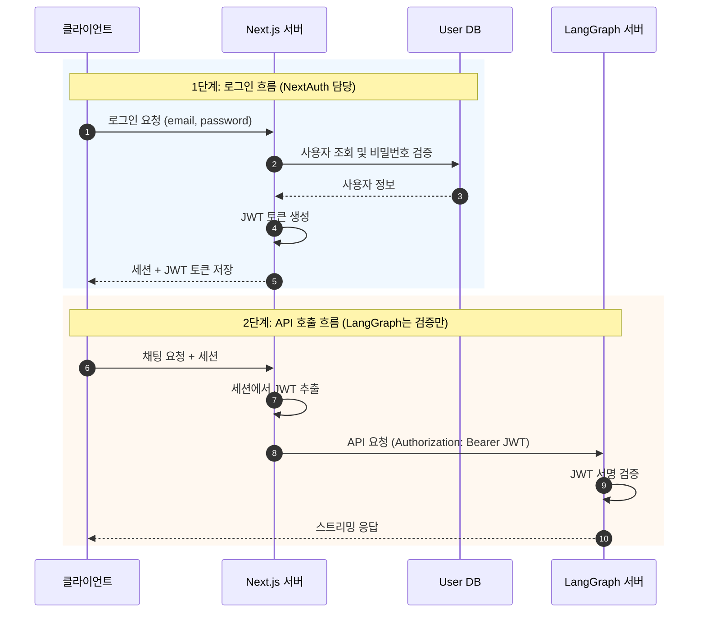

# NextAuth Credentials 인증

NextAuth의 Credentials Provider를 사용하여 ID/PW 로그인을 처리하고, LangGraph 서버에서 JWT를 검증하는 방식입니다.

## 목차

1. [아키텍처 개요](#아키텍처-개요)
2. [장단점](#장단점)
3. [구현 가이드](#구현-가이드)
4. [LangGraph 연동](#langgraph-연동)

---

## 아키텍처 개요



---

## 장단점

### 장점

- **자체 사용자 관리**: 외부 OAuth 없이 직접 사용자 DB 관리
- **커스터마이징**: 로그인 UI, 검증 로직 자유롭게 구현
- **오프라인 가능**: 외부 서비스 의존 없음

### 단점

- **보안 책임**: 비밀번호 해싱, 보안 정책 직접 구현
- **사용자 경험**: 소셜 로그인 대비 가입 허들 높음

---

## 구현 가이드

### 1. NextAuth 설정

```typescript
// app/api/auth/[...nextauth]/route.ts
import NextAuth from "next-auth";
import CredentialsProvider from "next-auth/providers/credentials";
import { compare } from "bcryptjs";
import jwt from "jsonwebtoken";

const JWT_SECRET = process.env.JWT_SECRET_KEY!;

export const authOptions = {
  providers: [
    CredentialsProvider({
      name: "Credentials",
      credentials: {
        email: { label: "Email", type: "email" },
        password: { label: "Password", type: "password" },
      },
      async authorize(credentials) {
        if (!credentials?.email || !credentials?.password) {
          return null;
        }

        // DB에서 사용자 조회
        const user = await findUserByEmail(credentials.email);
        if (!user) {
          return null;
        }

        // 비밀번호 검증
        const isValid = await compare(credentials.password, user.passwordHash);
        if (!isValid) {
          return null;
        }

        return {
          id: user.id,
          email: user.email,
          name: user.name,
        };
      },
    }),
  ],
  callbacks: {
    async jwt({ token, user }) {
      if (user) {
        token.id = user.id;
      }
      return token;
    },
    async session({ session, token }) {
      const langgraphToken = jwt.sign(
        {
          sub: token.id,
          email: token.email,
          name: token.name,
        },
        JWT_SECRET,
        { expiresIn: "1h" },
      );

      session.langgraphToken = langgraphToken;
      session.user.id = token.id as string;
      return session;
    },
  },
  pages: {
    signIn: "/login",
  },
  secret: JWT_SECRET,
};

const handler = NextAuth(authOptions);
export { handler as GET, handler as POST };
```

### 2. 사용자 조회 함수

```typescript
// lib/db.ts
import { prisma } from "./prisma";

export async function findUserByEmail(email: string) {
  return prisma.user.findUnique({
    where: { email },
  });
}
```

### 3. 회원가입 API

```typescript
// app/api/auth/register/route.ts
import { hash } from "bcryptjs";
import { prisma } from "@/lib/prisma";

export async function POST(request: Request) {
  const { email, password, name } = await request.json();

  // 이메일 중복 확인
  const existing = await prisma.user.findUnique({ where: { email } });
  if (existing) {
    return Response.json({ error: "Email already exists" }, { status: 400 });
  }

  // 비밀번호 해싱
  const passwordHash = await hash(password, 12);

  // 사용자 생성
  const user = await prisma.user.create({
    data: { email, passwordHash, name },
  });

  return Response.json({ id: user.id, email: user.email });
}
```

### 4. 환경 변수

```env
# .env.local
NEXTAUTH_URL=http://localhost:3000
NEXTAUTH_SECRET=your-nextauth-secret

# JWT (LangGraph와 공유)
JWT_SECRET_KEY=your-shared-jwt-secret

# Database
DATABASE_URL=postgresql://...
```

---

## LangGraph 연동

LangGraph 측 설정은 [01-NEXTAUTH-OAUTH.md](./01-NEXTAUTH-OAUTH.ko.md)와 동일합니다. JWT 서명만 검증하면 됩니다.

```python
# src/security/auth.py
import os
import jwt
from langgraph_sdk import Auth

JWT_SECRET_KEY = os.environ.get("JWT_SECRET_KEY", "")
JWT_ALGORITHM = "HS256"

auth = Auth()


@auth.authenticate
async def authenticate(authorization: str | None) -> Auth.types.MinimalUserDict:
    """NextAuth에서 발급한 JWT 토큰 검증"""
    if not authorization:
        raise Auth.exceptions.HTTPException(
            status_code=401,
            detail="Authorization header required"
        )

    scheme, _, token = authorization.partition(" ")
    if scheme.lower() != "bearer" or not token:
        raise Auth.exceptions.HTTPException(
            status_code=401,
            detail="Invalid authorization scheme"
        )

    try:
        payload = jwt.decode(token, JWT_SECRET_KEY, algorithms=[JWT_ALGORITHM])
    except jwt.InvalidTokenError:
        raise Auth.exceptions.HTTPException(
            status_code=401,
            detail="Invalid token"
        )

    return {
        "identity": payload.get("sub"),
        "email": payload.get("email", ""),
    }
```

---

## 체크리스트

- [ ] NextAuth Credentials Provider 설정
- [ ] 사용자 DB 및 스키마 생성
- [ ] 비밀번호 해싱 (bcrypt) 적용
- [ ] 회원가입 API 구현
- [ ] JWT_SECRET_KEY 양쪽 동일하게 설정
- [ ] LangGraph auth.py 구현

---

## 다음 단계

- OAuth 로그인 추가: [01-NEXTAUTH-OAUTH.md](./01-NEXTAUTH-OAUTH.ko.md)
- Email 인증 추가: [03-NEXTAUTH-EMAIL.md](./03-NEXTAUTH-EMAIL.ko.md)
