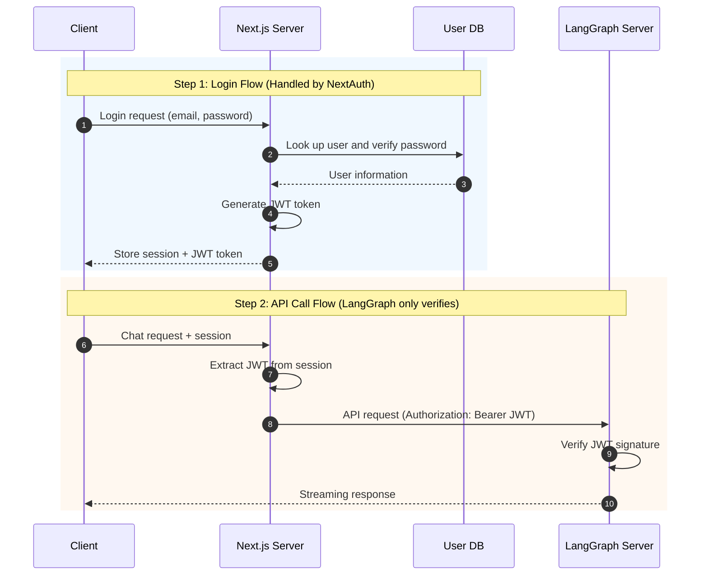

# NextAuth Credentials Authentication

This approach uses NextAuth's Credentials Provider to handle ID/PW login and verifies the JWT on the LangGraph server.

## Table of Contents

1. [Architecture Overview](#architecture-overview)
2. [Pros and Cons](#pros-and-cons)
3. [Implementation Guide](#implementation-guide)
4. [LangGraph Integration](#langgraph-integration)

---

## Architecture Overview



---

## Pros and Cons

### Pros

- **Self-managed users**: Manage your own user DB without external OAuth
- **Customizable**: Freely implement login UI and validation logic
- **Offline capable**: No dependency on external services

### Cons

- **Security responsibility**: Must implement password hashing and security policies yourself
- **User experience**: Higher signup barrier compared to social login

---

## Implementation Guide

### 1. NextAuth Configuration

```typescript
// app/api/auth/[...nextauth]/route.ts
import NextAuth from "next-auth";
import CredentialsProvider from "next-auth/providers/credentials";
import { compare } from "bcryptjs";
import jwt from "jsonwebtoken";

const JWT_SECRET = process.env.JWT_SECRET_KEY!;

export const authOptions = {
  providers: [
    CredentialsProvider({
      name: "Credentials",
      credentials: {
        email: { label: "Email", type: "email" },
        password: { label: "Password", type: "password" },
      },
      async authorize(credentials) {
        if (!credentials?.email || !credentials?.password) {
          return null;
        }

        // Look up user from DB
        const user = await findUserByEmail(credentials.email);
        if (!user) {
          return null;
        }

        // Verify password
        const isValid = await compare(credentials.password, user.passwordHash);
        if (!isValid) {
          return null;
        }

        return {
          id: user.id,
          email: user.email,
          name: user.name,
        };
      },
    }),
  ],
  callbacks: {
    async jwt({ token, user }) {
      if (user) {
        token.id = user.id;
      }
      return token;
    },
    async session({ session, token }) {
      const langgraphToken = jwt.sign(
        {
          sub: token.id,
          email: token.email,
          name: token.name,
        },
        JWT_SECRET,
        { expiresIn: "1h" },
      );

      session.langgraphToken = langgraphToken;
      session.user.id = token.id as string;
      return session;
    },
  },
  pages: {
    signIn: "/login",
  },
  secret: JWT_SECRET,
};

const handler = NextAuth(authOptions);
export { handler as GET, handler as POST };
```

### 2. User Lookup Function

```typescript
// lib/db.ts
import { prisma } from "./prisma";

export async function findUserByEmail(email: string) {
  return prisma.user.findUnique({
    where: { email },
  });
}
```

### 3. Registration API

```typescript
// app/api/auth/register/route.ts
import { hash } from "bcryptjs";
import { prisma } from "@/lib/prisma";

export async function POST(request: Request) {
  const { email, password, name } = await request.json();

  // Check for duplicate email
  const existing = await prisma.user.findUnique({ where: { email } });
  if (existing) {
    return Response.json({ error: "Email already exists" }, { status: 400 });
  }

  // Hash the password
  const passwordHash = await hash(password, 12);

  // Create user
  const user = await prisma.user.create({
    data: { email, passwordHash, name },
  });

  return Response.json({ id: user.id, email: user.email });
}
```

### 4. Environment Variables

```env
# .env.local
NEXTAUTH_URL=http://localhost:3000
NEXTAUTH_SECRET=your-nextauth-secret

# JWT (shared with LangGraph)
JWT_SECRET_KEY=your-shared-jwt-secret

# Database
DATABASE_URL=postgresql://...
```

---

## LangGraph Integration

The LangGraph-side configuration is the same as in [01-NEXTAUTH-OAUTH.md](./01-NEXTAUTH-OAUTH.md). You only need to verify the JWT signature.

```python
# src/security/auth.py
import os
import jwt
from langgraph_sdk import Auth

JWT_SECRET_KEY = os.environ.get("JWT_SECRET_KEY", "")
JWT_ALGORITHM = "HS256"

auth = Auth()


@auth.authenticate
async def authenticate(authorization: str | None) -> Auth.types.MinimalUserDict:
    """Verify JWT token issued by NextAuth"""
    if not authorization:
        raise Auth.exceptions.HTTPException(
            status_code=401,
            detail="Authorization header required"
        )

    scheme, _, token = authorization.partition(" ")
    if scheme.lower() != "bearer" or not token:
        raise Auth.exceptions.HTTPException(
            status_code=401,
            detail="Invalid authorization scheme"
        )

    try:
        payload = jwt.decode(token, JWT_SECRET_KEY, algorithms=[JWT_ALGORITHM])
    except jwt.InvalidTokenError:
        raise Auth.exceptions.HTTPException(
            status_code=401,
            detail="Invalid token"
        )

    return {
        "identity": payload.get("sub"),
        "email": payload.get("email", ""),
    }
```

---

## Checklist

- [ ] NextAuth Credentials Provider configured
- [ ] User DB and schema created
- [ ] Password hashing (bcrypt) applied
- [ ] Registration API implemented
- [ ] JWT_SECRET_KEY set identically on both sides
- [ ] LangGraph auth.py implemented

---

## Next Steps

- Add OAuth login: [01-NEXTAUTH-OAUTH.md](./01-NEXTAUTH-OAUTH.md)
- Add Email authentication: [03-NEXTAUTH-EMAIL.md](./03-NEXTAUTH-EMAIL.md)
