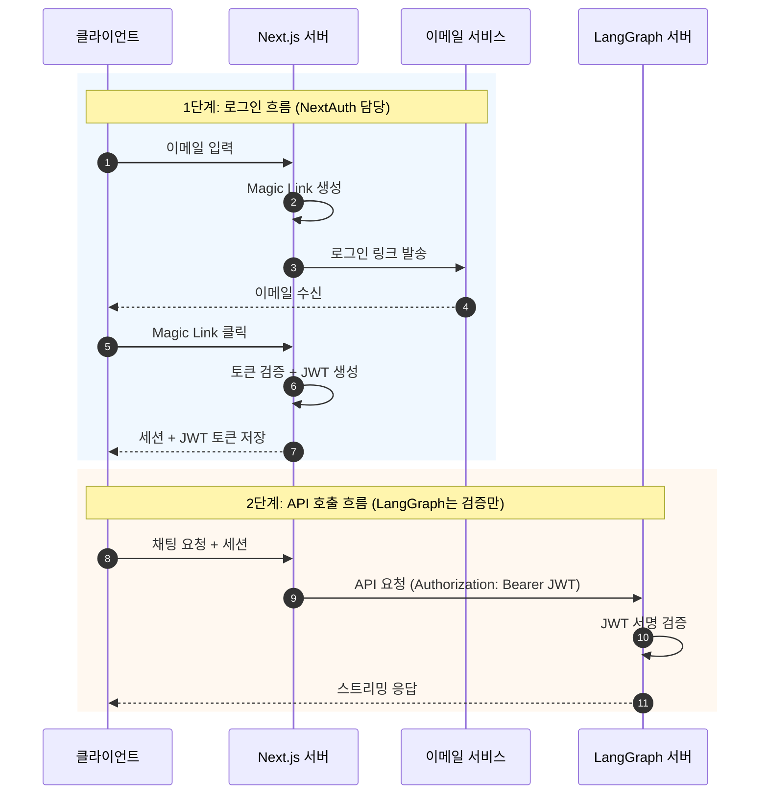

# NextAuth Email 인증

NextAuth의 Email Provider를 사용하여 Magic Link 로그인을 처리하고, LangGraph 서버에서 JWT를 검증하는 방식입니다.

## 목차

1. [아키텍처 개요](#아키텍처-개요)
2. [장단점](#장단점)
3. [구현 가이드](#구현-가이드)
4. [LangGraph 연동](#langgraph-연동)

---

## 아키텍처 개요



---

## 장단점

### 장점

- **비밀번호 불필요**: 보안 부담 감소
- **간편한 가입**: 이메일만으로 로그인/가입 동시 처리
- **보안성**: 이메일 소유 확인으로 인증

### 단점

- **이메일 의존**: 이메일 서비스 필수
- **지연**: 이메일 도착까지 대기 필요
- **스팸 위험**: 발송 이메일이 스팸 처리될 수 있음

---

## 구현 가이드

### 1. NextAuth 설정

```typescript
// app/api/auth/[...nextauth]/route.ts
import NextAuth from "next-auth";
import EmailProvider from "next-auth/providers/email";
import { PrismaAdapter } from "@auth/prisma-adapter";
import { prisma } from "@/lib/prisma";
import jwt from "jsonwebtoken";

const JWT_SECRET = process.env.JWT_SECRET_KEY!;

export const authOptions = {
  adapter: PrismaAdapter(prisma),
  providers: [
    EmailProvider({
      server: {
        host: process.env.EMAIL_SERVER_HOST,
        port: process.env.EMAIL_SERVER_PORT,
        auth: {
          user: process.env.EMAIL_SERVER_USER,
          pass: process.env.EMAIL_SERVER_PASSWORD,
        },
      },
      from: process.env.EMAIL_FROM,
    }),
  ],
  callbacks: {
    async session({ session, user }) {
      const langgraphToken = jwt.sign(
        {
          sub: user.id,
          email: user.email,
          name: user.name,
        },
        JWT_SECRET,
        { expiresIn: "1h" },
      );

      session.langgraphToken = langgraphToken;
      session.user.id = user.id;
      return session;
    },
  },
  secret: JWT_SECRET,
};

const handler = NextAuth(authOptions);
export { handler as GET, handler as POST };
```

### 2. Prisma 스키마

Email Provider는 DB Adapter가 필요합니다.

```prisma
// prisma/schema.prisma
model User {
  id            String    @id @default(cuid())
  name          String?
  email         String?   @unique
  emailVerified DateTime?
  image         String?
  accounts      Account[]
  sessions      Session[]
}

model Account {
  id                String  @id @default(cuid())
  userId            String
  type              String
  provider          String
  providerAccountId String
  refresh_token     String?
  access_token      String?
  expires_at        Int?
  token_type        String?
  scope             String?
  id_token          String?
  session_state     String?
  user              User    @relation(fields: [userId], references: [id], onDelete: Cascade)

  @@unique([provider, providerAccountId])
}

model Session {
  id           String   @id @default(cuid())
  sessionToken String   @unique
  userId       String
  expires      DateTime
  user         User     @relation(fields: [userId], references: [id], onDelete: Cascade)
}

model VerificationToken {
  identifier String
  token      String   @unique
  expires    DateTime

  @@unique([identifier, token])
}
```

### 3. 환경 변수

```env
# .env.local
NEXTAUTH_URL=http://localhost:3000
NEXTAUTH_SECRET=your-nextauth-secret

# JWT (LangGraph와 공유)
JWT_SECRET_KEY=your-shared-jwt-secret

# Email (예: Gmail SMTP)
EMAIL_SERVER_HOST=smtp.gmail.com
EMAIL_SERVER_PORT=587
EMAIL_SERVER_USER=your-email@gmail.com
EMAIL_SERVER_PASSWORD=your-app-password
EMAIL_FROM=noreply@yourdomain.com

# Database
DATABASE_URL=postgresql://...
```

### 4. 커스텀 이메일 템플릿 (선택)

```typescript
EmailProvider({
  // ...
  sendVerificationRequest: async ({ identifier, url, provider }) => {
    const { host } = new URL(url);
    await sendEmail({
      to: identifier,
      subject: `${host} 로그인`,
      html: `
        <h1>로그인 링크</h1>
        <p>아래 버튼을 클릭하여 로그인하세요.</p>
        <a href="${url}" style="background: #000; color: #fff; padding: 12px 24px; text-decoration: none; border-radius: 4px;">
          로그인
        </a>
        <p>이 링크는 24시간 동안 유효합니다.</p>
      `,
    });
  },
});
```

---

## LangGraph 연동

LangGraph 측 설정은 [01-NEXTAUTH-OAUTH.md](./01-NEXTAUTH-OAUTH.ko.md)와 동일합니다. JWT 서명만 검증하면 됩니다.

```python
# src/security/auth.py
import os
import jwt
from langgraph_sdk import Auth

JWT_SECRET_KEY = os.environ.get("JWT_SECRET_KEY", "")
JWT_ALGORITHM = "HS256"

auth = Auth()


@auth.authenticate
async def authenticate(authorization: str | None) -> Auth.types.MinimalUserDict:
    """NextAuth에서 발급한 JWT 토큰 검증"""
    if not authorization:
        raise Auth.exceptions.HTTPException(
            status_code=401,
            detail="Authorization header required"
        )

    scheme, _, token = authorization.partition(" ")
    if scheme.lower() != "bearer" or not token:
        raise Auth.exceptions.HTTPException(
            status_code=401,
            detail="Invalid authorization scheme"
        )

    try:
        payload = jwt.decode(token, JWT_SECRET_KEY, algorithms=[JWT_ALGORITHM])
    except jwt.InvalidTokenError:
        raise Auth.exceptions.HTTPException(
            status_code=401,
            detail="Invalid token"
        )

    return {
        "identity": payload.get("sub"),
        "email": payload.get("email", ""),
    }
```

---

## 체크리스트

- [ ] NextAuth Email Provider 설정
- [ ] Prisma Adapter 설정
- [ ] 이메일 서비스 설정 (SMTP)
- [ ] DB 마이그레이션
- [ ] JWT_SECRET_KEY 양쪽 동일하게 설정
- [ ] LangGraph auth.py 구현
- [ ] 이메일 템플릿 커스터마이징 (선택)

---

## 다음 단계

- OAuth 로그인 추가: [01-NEXTAUTH-OAUTH.md](./01-NEXTAUTH-OAUTH.ko.md)
- ID/PW 로그인 추가: [02-NEXTAUTH-CREDENTIALS.md](./02-NEXTAUTH-CREDENTIALS.ko.md)
