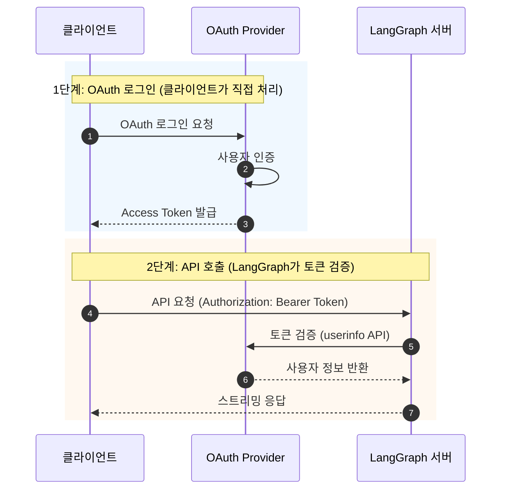
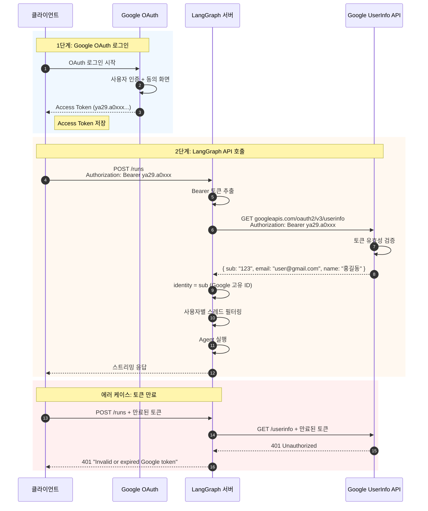
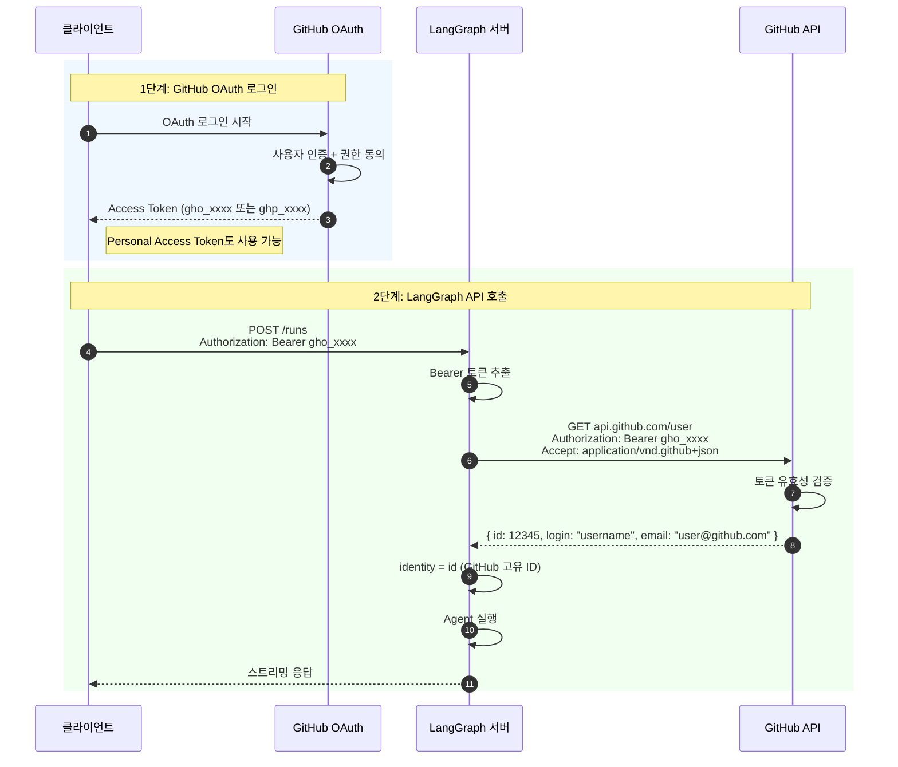
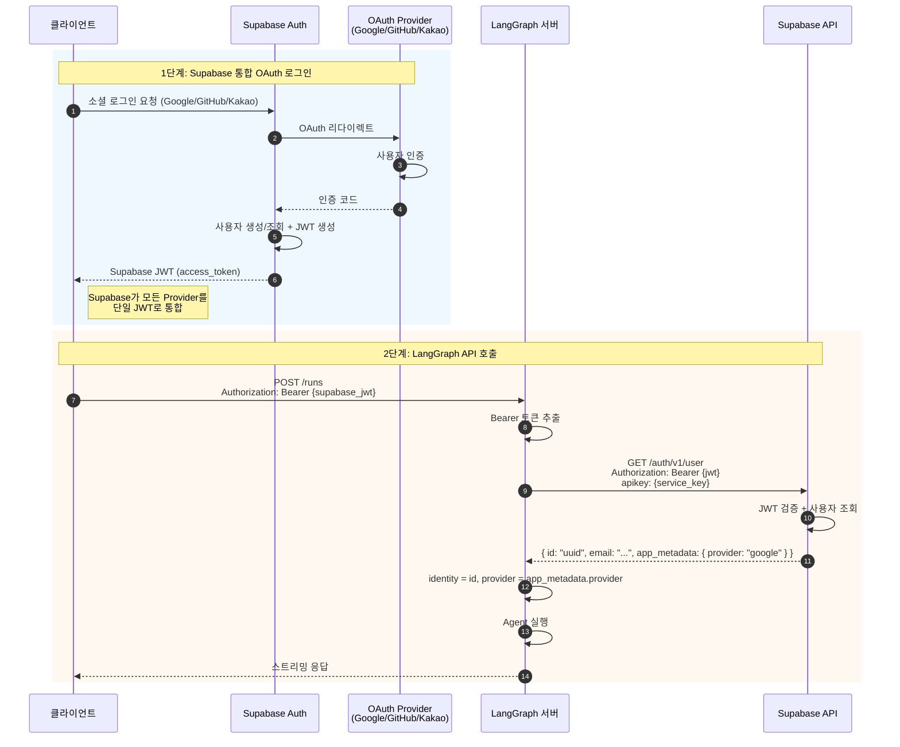
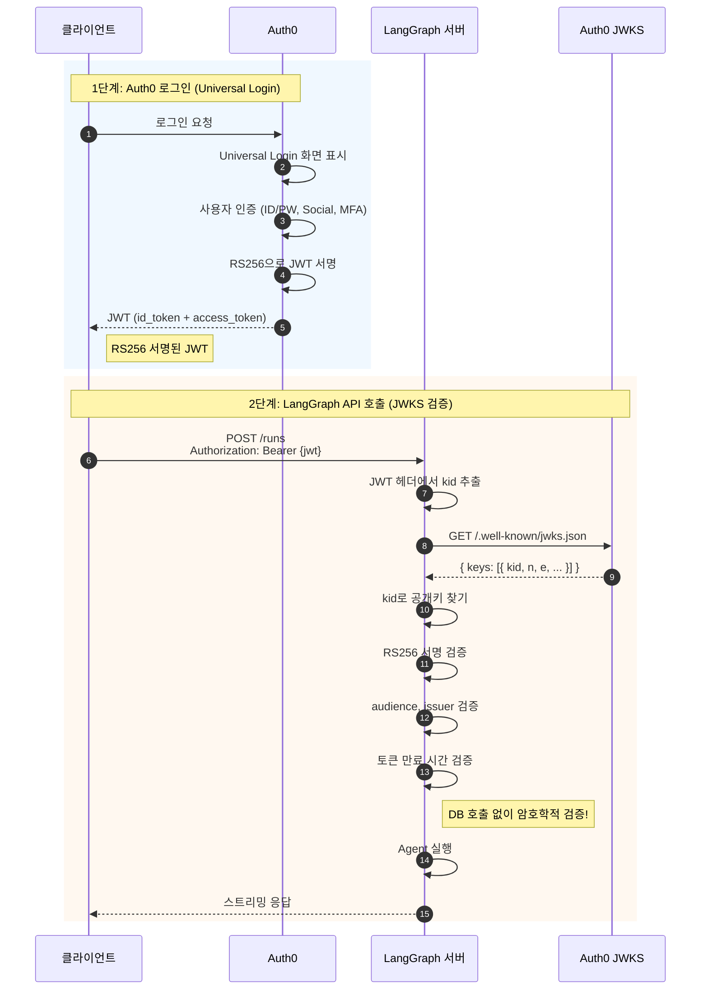
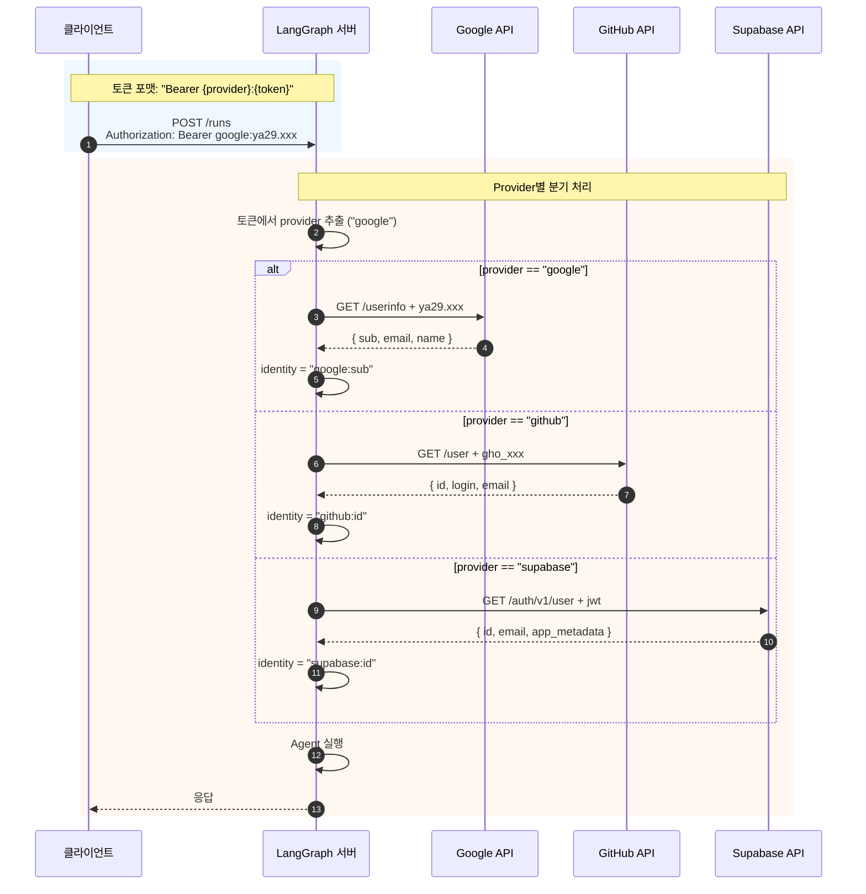
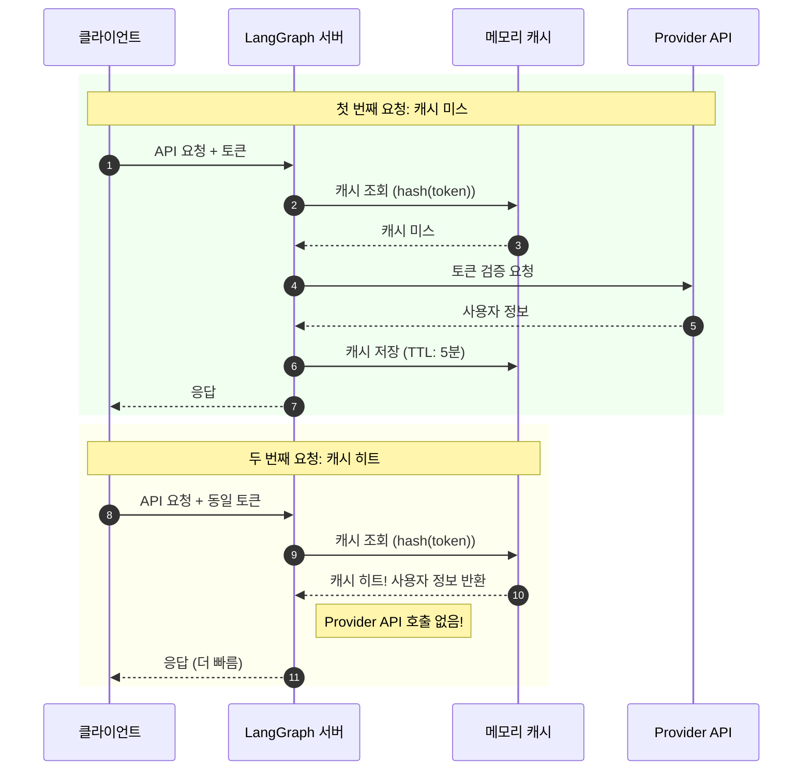

# OAuth 토큰 직접 검증

LangGraph 서버에서 Google, GitHub 등 OAuth Provider의 토큰을 직접 검증하는 방식입니다. NextAuth 없이 프론트엔드나 CLI에서 직접 사용할 수 있습니다.

## 목차

1. [아키텍처 개요](#아키텍처-개요)
2. [장단점](#장단점)
3. [Google OAuth 통합](#google-oauth-통합)
4. [GitHub OAuth 통합](#github-oauth-통합)
5. [Supabase 통합](#supabase-통합)
6. [Auth0 통합](#auth0-통합)
7. [멀티 Provider 지원](#멀티-provider-지원)

---

## 아키텍처 개요



### 핵심 특징

| 항목           | 설명                                      |
| -------------- | ----------------------------------------- |
| **토큰 발급**  | OAuth Provider (Google, GitHub 등)        |
| **토큰 검증**  | LangGraph 서버에서 Provider API 호출      |
| **프론트엔드** | 불필요 (CLI, 모바일 앱 등 직접 사용 가능) |
| **사용자 DB**  | 선택적 (Provider가 관리)                  |

---

## 장단점

### 장점

- **프론트엔드 독립**: Next.js 없이 동작
- **직접 통합**: Provider API와 직접 통신
- **다양한 클라이언트**: CLI, 모바일, 데스크톱 앱 지원
- **표준화**: OAuth 2.0 표준 준수

### 단점

- **API 호출 오버헤드**: 매 요청마다 Provider API 호출
- **Rate Limit**: Provider API 제한에 영향
- **직접 구현**: Provider별 코드 필요
- **토큰 관리**: 클라이언트가 직접 토큰 관리

---

## Google OAuth 통합



### 구현

#### 환경 변수 (`.env`)

```env
# Google OAuth 검증에는 별도 환경변수 불필요
# (토큰 자체로 Google API 호출)
```

#### 인증 핸들러 (`src/security/auth.py`)

```python
import httpx
from langgraph_sdk import Auth

auth = Auth()

GOOGLE_USERINFO_URL = "https://www.googleapis.com/oauth2/v3/userinfo"


@auth.authenticate
async def authenticate(authorization: str | None) -> Auth.types.MinimalUserDict:
    """Google OAuth Access Token 검증"""
    if not authorization:
        raise Auth.exceptions.HTTPException(
            status_code=401,
            detail="Authorization header required"
        )

    scheme, _, token = authorization.partition(" ")
    if scheme.lower() != "bearer" or not token:
        raise Auth.exceptions.HTTPException(
            status_code=401,
            detail="Invalid authorization scheme"
        )

    # Google API로 토큰 검증
    async with httpx.AsyncClient() as client:
        response = await client.get(
            GOOGLE_USERINFO_URL,
            headers={"Authorization": f"Bearer {token}"}
        )

    if response.status_code != 200:
        raise Auth.exceptions.HTTPException(
            status_code=401,
            detail="Invalid or expired Google token"
        )

    user_info = response.json()

    return {
        "identity": user_info["sub"],  # Google 고유 ID
        "email": user_info.get("email", ""),
        "name": user_info.get("name", ""),
        "picture": user_info.get("picture", ""),
        "provider": "google",
    }


@auth.on
async def filter_by_owner(ctx: Auth.types.AuthContext, value: dict) -> dict:
    """사용자별 스레드 격리"""
    metadata = value.setdefault("metadata", {})
    metadata["owner"] = ctx.user.identity
    return {"owner": ctx.user.identity}
```

### 클라이언트 사용 예시

#### Python

```python
from langgraph_sdk import get_client

# Google에서 받은 Access Token
google_token = "ya29.a0..."

client = get_client(
    url="http://localhost:2024",
    headers={"Authorization": f"Bearer {google_token}"}
)

# 스레드 생성
thread = await client.threads.create()
```

#### cURL

```bash
curl -X POST http://localhost:2024/runs \
  -H "Authorization: Bearer ya29.a0..." \
  -H "Content-Type: application/json" \
  -d '{
    "assistant_id": "agent",
    "input": {"messages": [{"role": "user", "content": "Hello"}]}
  }'
```

---

## GitHub OAuth 통합



### 구현

```python
import httpx
from langgraph_sdk import Auth

auth = Auth()

GITHUB_USER_URL = "https://api.github.com/user"


@auth.authenticate
async def authenticate(authorization: str | None) -> Auth.types.MinimalUserDict:
    """GitHub OAuth Access Token 검증"""
    if not authorization:
        raise Auth.exceptions.HTTPException(status_code=401, detail="Unauthorized")

    scheme, _, token = authorization.partition(" ")
    if scheme.lower() != "bearer" or not token:
        raise Auth.exceptions.HTTPException(status_code=401, detail="Invalid token")

    # GitHub API로 토큰 검증
    async with httpx.AsyncClient() as client:
        response = await client.get(
            GITHUB_USER_URL,
            headers={
                "Authorization": f"Bearer {token}",
                "Accept": "application/vnd.github+json",
            }
        )

    if response.status_code != 200:
        raise Auth.exceptions.HTTPException(
            status_code=401,
            detail="Invalid or expired GitHub token"
        )

    user_info = response.json()

    return {
        "identity": str(user_info["id"]),
        "email": user_info.get("email", ""),
        "name": user_info.get("name", user_info["login"]),
        "avatar_url": user_info.get("avatar_url", ""),
        "provider": "github",
    }
```

---

## Supabase 통합

Supabase를 사용하면 Google, GitHub 등 여러 Provider를 단일 인터페이스로 관리할 수 있습니다.



### 구현

#### 환경 변수 (`.env`)

```env
SUPABASE_URL=https://your-project.supabase.co
SUPABASE_SERVICE_KEY=eyJhbGciOiJIUzI1NiIsInR5cCI6IkpXVCJ9...
```

#### 인증 핸들러

```python
import os
import httpx
from langgraph_sdk import Auth

SUPABASE_URL = os.environ["SUPABASE_URL"]
SUPABASE_SERVICE_KEY = os.environ["SUPABASE_SERVICE_KEY"]

auth = Auth()


@auth.authenticate
async def authenticate(authorization: str | None) -> Auth.types.MinimalUserDict:
    """Supabase JWT 검증"""
    if not authorization:
        raise Auth.exceptions.HTTPException(status_code=401, detail="Unauthorized")

    scheme, _, token = authorization.partition(" ")
    if scheme.lower() != "bearer" or not token:
        raise Auth.exceptions.HTTPException(status_code=401, detail="Invalid token")

    # Supabase API로 토큰 검증
    async with httpx.AsyncClient() as client:
        response = await client.get(
            f"{SUPABASE_URL}/auth/v1/user",
            headers={
                "Authorization": f"Bearer {token}",
                "apikey": SUPABASE_SERVICE_KEY,
            }
        )

    if response.status_code != 200:
        raise Auth.exceptions.HTTPException(
            status_code=401,
            detail="Invalid or expired Supabase token"
        )

    user_data = response.json()

    # Provider 정보 추출
    provider = "email"
    if user_data.get("app_metadata", {}).get("provider"):
        provider = user_data["app_metadata"]["provider"]

    return {
        "identity": user_data["id"],
        "email": user_data.get("email", ""),
        "provider": provider,
        "metadata": user_data.get("user_metadata", {}),
    }
```

---

## Auth0 통합



### 구현

#### 환경 변수 (`.env`)

```env
AUTH0_DOMAIN=your-tenant.auth0.com
AUTH0_AUDIENCE=https://your-api-identifier
```

#### 인증 핸들러

```python
import os
import httpx
import jwt
from jwt import PyJWKClient
from langgraph_sdk import Auth

AUTH0_DOMAIN = os.environ["AUTH0_DOMAIN"]
AUTH0_AUDIENCE = os.environ["AUTH0_AUDIENCE"]

# Auth0 JWKS URL
JWKS_URL = f"https://{AUTH0_DOMAIN}/.well-known/jwks.json"
jwks_client = PyJWKClient(JWKS_URL)

auth = Auth()


@auth.authenticate
async def authenticate(authorization: str | None) -> Auth.types.MinimalUserDict:
    """Auth0 JWT 검증"""
    if not authorization:
        raise Auth.exceptions.HTTPException(status_code=401, detail="Unauthorized")

    scheme, _, token = authorization.partition(" ")
    if scheme.lower() != "bearer" or not token:
        raise Auth.exceptions.HTTPException(status_code=401, detail="Invalid token")

    try:
        # JWKS로 서명 검증
        signing_key = jwks_client.get_signing_key_from_jwt(token)

        payload = jwt.decode(
            token,
            signing_key.key,
            algorithms=["RS256"],
            audience=AUTH0_AUDIENCE,
            issuer=f"https://{AUTH0_DOMAIN}/"
        )
    except jwt.ExpiredSignatureError:
        raise Auth.exceptions.HTTPException(status_code=401, detail="Token expired")
    except jwt.InvalidTokenError as e:
        raise Auth.exceptions.HTTPException(status_code=401, detail=f"Invalid token: {e}")

    return {
        "identity": payload["sub"],
        "email": payload.get("email", ""),
        "permissions": payload.get("permissions", []),
        "provider": "auth0",
    }
```

---

## 멀티 Provider 지원

여러 OAuth Provider를 동시에 지원하는 방법입니다.



### 구현

```python
import os
import httpx
from langgraph_sdk import Auth

auth = Auth()

# Provider 설정
PROVIDERS = {
    "google": {
        "userinfo_url": "https://www.googleapis.com/oauth2/v3/userinfo",
        "id_field": "sub",
    },
    "github": {
        "userinfo_url": "https://api.github.com/user",
        "id_field": "id",
        "extra_headers": {"Accept": "application/vnd.github+json"},
    },
    "supabase": {
        "userinfo_url": f"{os.environ.get('SUPABASE_URL', '')}/auth/v1/user",
        "id_field": "id",
        "extra_headers": {"apikey": os.environ.get("SUPABASE_SERVICE_KEY", "")},
    },
}


@auth.authenticate
async def authenticate(authorization: str | None) -> Auth.types.MinimalUserDict:
    """멀티 Provider 토큰 검증

    토큰 포맷: "Bearer {provider}:{token}"
    예: "Bearer google:ya29.xxx" 또는 "Bearer github:gho_xxx"
    """
    if not authorization:
        raise Auth.exceptions.HTTPException(status_code=401, detail="Unauthorized")

    scheme, _, token_part = authorization.partition(" ")
    if scheme.lower() != "bearer" or not token_part:
        raise Auth.exceptions.HTTPException(status_code=401, detail="Invalid token")

    # Provider 감지
    if ":" in token_part:
        provider, token = token_part.split(":", 1)
    else:
        # 기본값: 토큰 prefix로 추측
        if token_part.startswith("ya29."):
            provider, token = "google", token_part
        elif token_part.startswith("gho_") or token_part.startswith("ghp_"):
            provider, token = "github", token_part
        else:
            provider, token = "supabase", token_part

    if provider not in PROVIDERS:
        raise Auth.exceptions.HTTPException(
            status_code=401,
            detail=f"Unsupported provider: {provider}"
        )

    config = PROVIDERS[provider]

    # Provider API로 검증
    async with httpx.AsyncClient() as client:
        headers = {"Authorization": f"Bearer {token}"}
        headers.update(config.get("extra_headers", {}))

        response = await client.get(config["userinfo_url"], headers=headers)

    if response.status_code != 200:
        raise Auth.exceptions.HTTPException(
            status_code=401,
            detail=f"Invalid {provider} token"
        )

    user_info = response.json()

    return {
        "identity": f"{provider}:{user_info[config['id_field']]}",
        "email": user_info.get("email", ""),
        "name": user_info.get("name", user_info.get("login", "")),
        "provider": provider,
    }


@auth.on
async def filter_by_owner(ctx: Auth.types.AuthContext, value: dict) -> dict:
    """Provider 포함 identity로 격리"""
    metadata = value.setdefault("metadata", {})
    metadata["owner"] = ctx.user.identity
    metadata["provider"] = ctx.user.get("provider", "unknown")
    return {"owner": ctx.user.identity}
```

### 클라이언트 사용

```python
# Google 사용자
client = get_client(
    url="http://localhost:2024",
    headers={"Authorization": "Bearer google:ya29.a0..."}
)

# GitHub 사용자
client = get_client(
    url="http://localhost:2024",
    headers={"Authorization": "Bearer github:gho_..."}
)

# 또는 토큰만 (자동 감지)
client = get_client(
    url="http://localhost:2024",
    headers={"Authorization": "Bearer ya29.a0..."}  # Google로 자동 감지
)
```

---

## 캐싱으로 성능 최적화



```python
from functools import lru_cache
import time
import hashlib

# 간단한 메모리 캐시
_token_cache: dict[str, tuple[dict, float]] = {}
CACHE_TTL = 300  # 5분


async def verify_token_with_cache(provider: str, token: str) -> dict:
    """토큰 검증 결과 캐싱"""
    cache_key = hashlib.sha256(f"{provider}:{token}".encode()).hexdigest()

    # 캐시 확인
    if cache_key in _token_cache:
        user_info, cached_at = _token_cache[cache_key]
        if time.time() - cached_at < CACHE_TTL:
            return user_info

    # Provider API 호출
    user_info = await verify_with_provider(provider, token)

    # 캐시 저장
    _token_cache[cache_key] = (user_info, time.time())

    return user_info
```

---

## 체크리스트

- [ ] 사용할 OAuth Provider 선택
- [ ] Provider Console에서 앱 등록 및 설정
- [ ] 환경 변수 설정
- [ ] auth.py에서 Provider별 검증 로직 구현
- [ ] 토큰 캐싱 적용 (선택)
- [ ] 에러 처리 및 로깅 구현
- [ ] 클라이언트 테스트

---

## 다음 단계

- 완전한 자체 인증 시스템 구축: [05-STANDALONE.md](./05-STANDALONE.ko.md)
- 개요로 돌아가기: [00-OVERVIEW.md](./00-OVERVIEW.ko.md)
