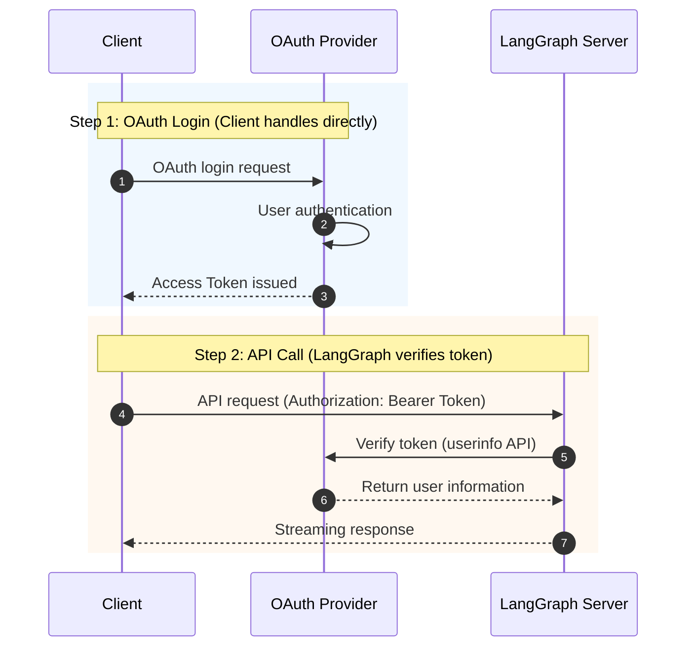
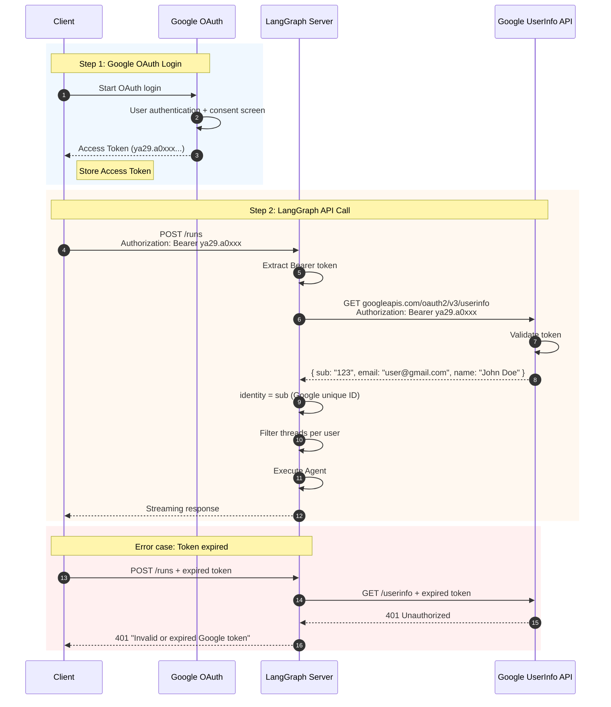
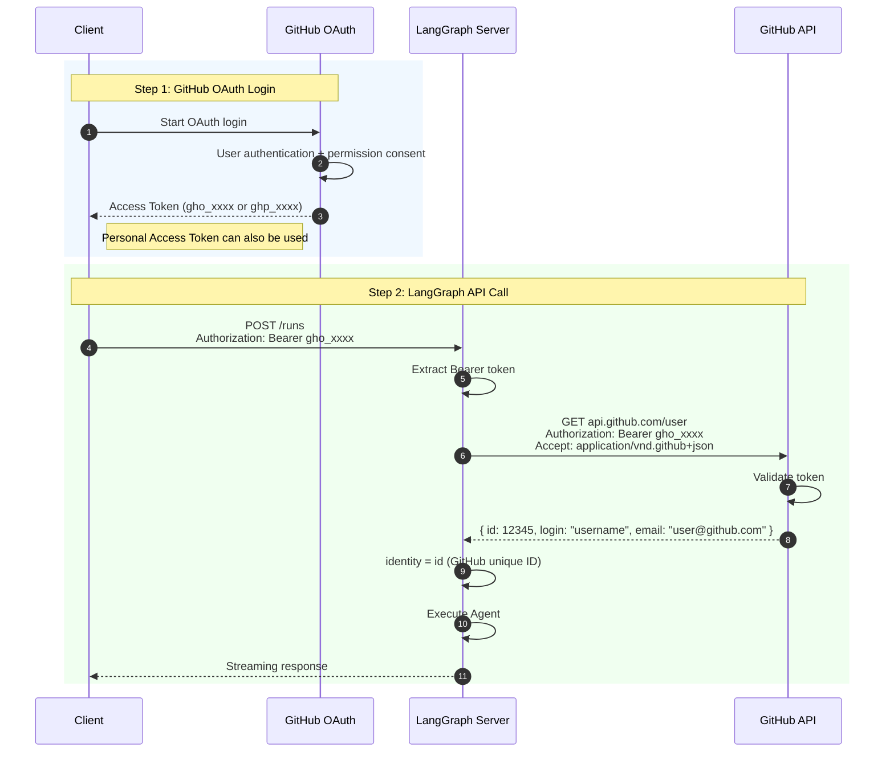
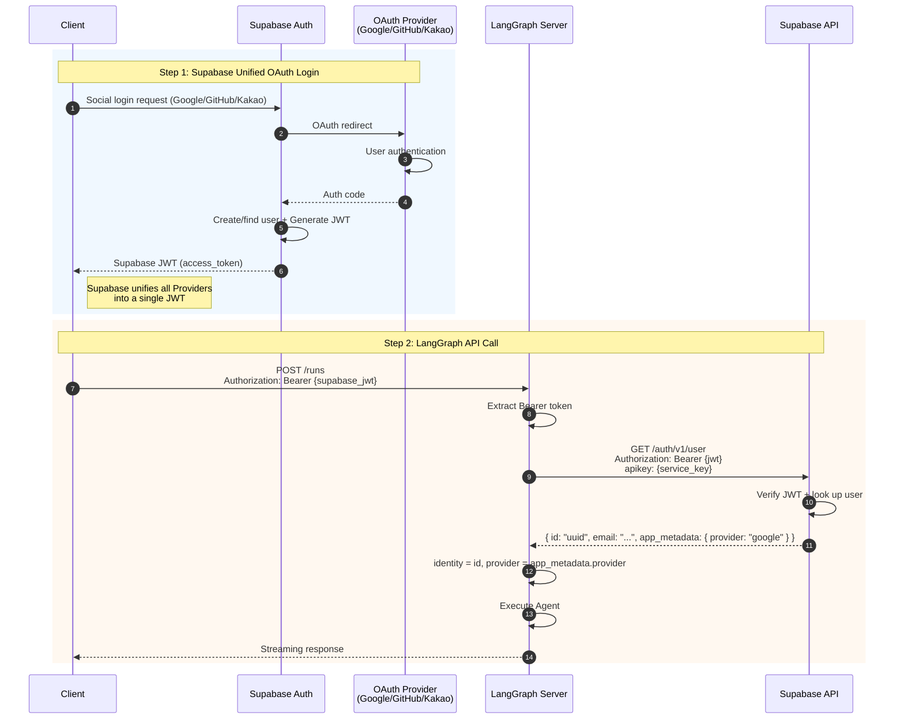
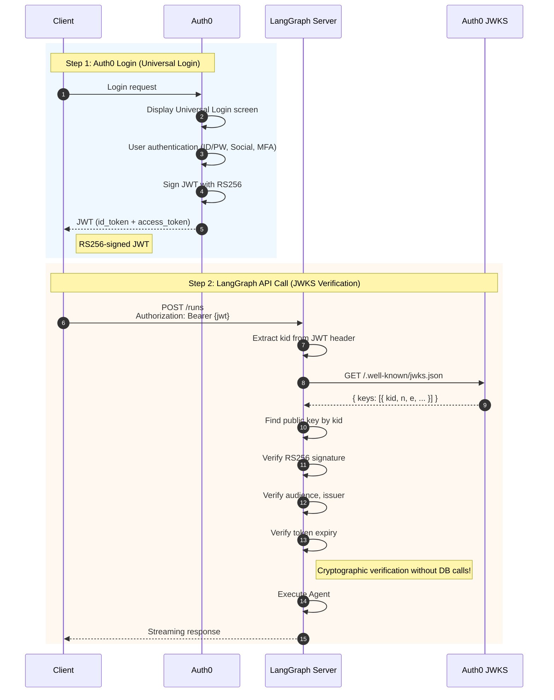
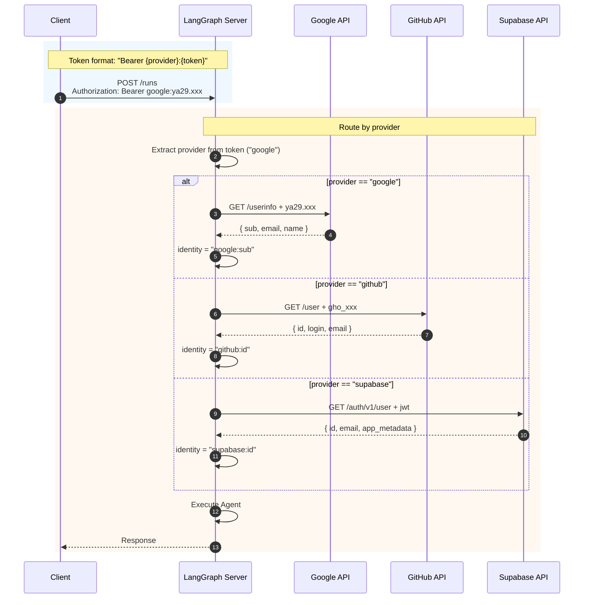
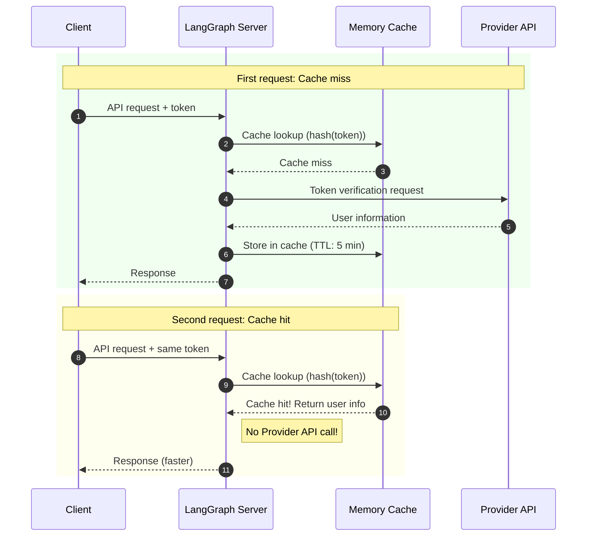

# Direct OAuth Token Verification

This approach verifies OAuth Provider tokens (Google, GitHub, etc.) directly on the LangGraph server. It can be used directly from a frontend or CLI without NextAuth.

## Table of Contents

1. [Architecture Overview](#architecture-overview)
2. [Pros and Cons](#pros-and-cons)
3. [Google OAuth Integration](#google-oauth-integration)
4. [GitHub OAuth Integration](#github-oauth-integration)
5. [Supabase Integration](#supabase-integration)
6. [Auth0 Integration](#auth0-integration)
7. [Multi-Provider Support](#multi-provider-support)

---

## Architecture Overview



### Key Characteristics

| Item             | Description                                    |
| ---------------- | ---------------------------------------------- |
| **Token Issuer** | OAuth Provider (Google, GitHub, etc.)          |
| **Token Verification** | LangGraph server calls Provider API      |
| **Frontend**     | Not required (can be used directly from CLI, mobile apps, etc.) |
| **User DB**      | Optional (managed by Provider)                 |

---

## Pros and Cons

### Pros

- **Frontend independent**: Works without Next.js
- **Direct integration**: Communicates directly with Provider API
- **Diverse clients**: Supports CLI, mobile, desktop apps
- **Standardized**: Follows OAuth 2.0 standards

### Cons

- **API call overhead**: Calls Provider API on every request
- **Rate Limit**: Subject to Provider API limits
- **Manual implementation**: Requires per-Provider code
- **Token management**: Client must manage tokens directly

---

## Google OAuth Integration



### Implementation

#### Environment Variables (`.env`)

```env
# No additional environment variables needed for Google OAuth verification
# (Google API is called using the token itself)
```

#### Auth Handler (`src/security/auth.py`)

```python
import httpx
from langgraph_sdk import Auth

auth = Auth()

GOOGLE_USERINFO_URL = "https://www.googleapis.com/oauth2/v3/userinfo"


@auth.authenticate
async def authenticate(authorization: str | None) -> Auth.types.MinimalUserDict:
    """Verify Google OAuth Access Token"""
    if not authorization:
        raise Auth.exceptions.HTTPException(
            status_code=401,
            detail="Authorization header required"
        )

    scheme, _, token = authorization.partition(" ")
    if scheme.lower() != "bearer" or not token:
        raise Auth.exceptions.HTTPException(
            status_code=401,
            detail="Invalid authorization scheme"
        )

    # Verify token via Google API
    async with httpx.AsyncClient() as client:
        response = await client.get(
            GOOGLE_USERINFO_URL,
            headers={"Authorization": f"Bearer {token}"}
        )

    if response.status_code != 200:
        raise Auth.exceptions.HTTPException(
            status_code=401,
            detail="Invalid or expired Google token"
        )

    user_info = response.json()

    return {
        "identity": user_info["sub"],  # Google unique ID
        "email": user_info.get("email", ""),
        "name": user_info.get("name", ""),
        "picture": user_info.get("picture", ""),
        "provider": "google",
    }


@auth.on
async def filter_by_owner(ctx: Auth.types.AuthContext, value: dict) -> dict:
    """Isolate threads per user"""
    metadata = value.setdefault("metadata", {})
    metadata["owner"] = ctx.user.identity
    return {"owner": ctx.user.identity}
```

### Client Usage Examples

#### Python

```python
from langgraph_sdk import get_client

# Access Token obtained from Google
google_token = "ya29.a0..."

client = get_client(
    url="http://localhost:2024",
    headers={"Authorization": f"Bearer {google_token}"}
)

# Create thread
thread = await client.threads.create()
```

#### cURL

```bash
curl -X POST http://localhost:2024/runs \
  -H "Authorization: Bearer ya29.a0..." \
  -H "Content-Type: application/json" \
  -d '{
    "assistant_id": "agent",
    "input": {"messages": [{"role": "user", "content": "Hello"}]}
  }'
```

---

## GitHub OAuth Integration



### Implementation

```python
import httpx
from langgraph_sdk import Auth

auth = Auth()

GITHUB_USER_URL = "https://api.github.com/user"


@auth.authenticate
async def authenticate(authorization: str | None) -> Auth.types.MinimalUserDict:
    """Verify GitHub OAuth Access Token"""
    if not authorization:
        raise Auth.exceptions.HTTPException(status_code=401, detail="Unauthorized")

    scheme, _, token = authorization.partition(" ")
    if scheme.lower() != "bearer" or not token:
        raise Auth.exceptions.HTTPException(status_code=401, detail="Invalid token")

    # Verify token via GitHub API
    async with httpx.AsyncClient() as client:
        response = await client.get(
            GITHUB_USER_URL,
            headers={
                "Authorization": f"Bearer {token}",
                "Accept": "application/vnd.github+json",
            }
        )

    if response.status_code != 200:
        raise Auth.exceptions.HTTPException(
            status_code=401,
            detail="Invalid or expired GitHub token"
        )

    user_info = response.json()

    return {
        "identity": str(user_info["id"]),
        "email": user_info.get("email", ""),
        "name": user_info.get("name", user_info["login"]),
        "avatar_url": user_info.get("avatar_url", ""),
        "provider": "github",
    }
```

---

## Supabase Integration

Supabase allows you to manage multiple Providers (Google, GitHub, etc.) through a single interface.



### Implementation

#### Environment Variables (`.env`)

```env
SUPABASE_URL=https://your-project.supabase.co
SUPABASE_SERVICE_KEY=eyJhbGciOiJIUzI1NiIsInR5cCI6IkpXVCJ9...
```

#### Auth Handler

```python
import os
import httpx
from langgraph_sdk import Auth

SUPABASE_URL = os.environ["SUPABASE_URL"]
SUPABASE_SERVICE_KEY = os.environ["SUPABASE_SERVICE_KEY"]

auth = Auth()


@auth.authenticate
async def authenticate(authorization: str | None) -> Auth.types.MinimalUserDict:
    """Verify Supabase JWT"""
    if not authorization:
        raise Auth.exceptions.HTTPException(status_code=401, detail="Unauthorized")

    scheme, _, token = authorization.partition(" ")
    if scheme.lower() != "bearer" or not token:
        raise Auth.exceptions.HTTPException(status_code=401, detail="Invalid token")

    # Verify token via Supabase API
    async with httpx.AsyncClient() as client:
        response = await client.get(
            f"{SUPABASE_URL}/auth/v1/user",
            headers={
                "Authorization": f"Bearer {token}",
                "apikey": SUPABASE_SERVICE_KEY,
            }
        )

    if response.status_code != 200:
        raise Auth.exceptions.HTTPException(
            status_code=401,
            detail="Invalid or expired Supabase token"
        )

    user_data = response.json()

    # Extract provider information
    provider = "email"
    if user_data.get("app_metadata", {}).get("provider"):
        provider = user_data["app_metadata"]["provider"]

    return {
        "identity": user_data["id"],
        "email": user_data.get("email", ""),
        "provider": provider,
        "metadata": user_data.get("user_metadata", {}),
    }
```

---

## Auth0 Integration



### Implementation

#### Environment Variables (`.env`)

```env
AUTH0_DOMAIN=your-tenant.auth0.com
AUTH0_AUDIENCE=https://your-api-identifier
```

#### Auth Handler

```python
import os
import httpx
import jwt
from jwt import PyJWKClient
from langgraph_sdk import Auth

AUTH0_DOMAIN = os.environ["AUTH0_DOMAIN"]
AUTH0_AUDIENCE = os.environ["AUTH0_AUDIENCE"]

# Auth0 JWKS URL
JWKS_URL = f"https://{AUTH0_DOMAIN}/.well-known/jwks.json"
jwks_client = PyJWKClient(JWKS_URL)

auth = Auth()


@auth.authenticate
async def authenticate(authorization: str | None) -> Auth.types.MinimalUserDict:
    """Verify Auth0 JWT"""
    if not authorization:
        raise Auth.exceptions.HTTPException(status_code=401, detail="Unauthorized")

    scheme, _, token = authorization.partition(" ")
    if scheme.lower() != "bearer" or not token:
        raise Auth.exceptions.HTTPException(status_code=401, detail="Invalid token")

    try:
        # Verify signature via JWKS
        signing_key = jwks_client.get_signing_key_from_jwt(token)

        payload = jwt.decode(
            token,
            signing_key.key,
            algorithms=["RS256"],
            audience=AUTH0_AUDIENCE,
            issuer=f"https://{AUTH0_DOMAIN}/"
        )
    except jwt.ExpiredSignatureError:
        raise Auth.exceptions.HTTPException(status_code=401, detail="Token expired")
    except jwt.InvalidTokenError as e:
        raise Auth.exceptions.HTTPException(status_code=401, detail=f"Invalid token: {e}")

    return {
        "identity": payload["sub"],
        "email": payload.get("email", ""),
        "permissions": payload.get("permissions", []),
        "provider": "auth0",
    }
```

---

## Multi-Provider Support

Here is how to support multiple OAuth Providers simultaneously.



### Implementation

```python
import os
import httpx
from langgraph_sdk import Auth

auth = Auth()

# Provider configuration
PROVIDERS = {
    "google": {
        "userinfo_url": "https://www.googleapis.com/oauth2/v3/userinfo",
        "id_field": "sub",
    },
    "github": {
        "userinfo_url": "https://api.github.com/user",
        "id_field": "id",
        "extra_headers": {"Accept": "application/vnd.github+json"},
    },
    "supabase": {
        "userinfo_url": f"{os.environ.get('SUPABASE_URL', '')}/auth/v1/user",
        "id_field": "id",
        "extra_headers": {"apikey": os.environ.get("SUPABASE_SERVICE_KEY", "")},
    },
}


@auth.authenticate
async def authenticate(authorization: str | None) -> Auth.types.MinimalUserDict:
    """Multi-provider token verification

    Token format: "Bearer {provider}:{token}"
    Example: "Bearer google:ya29.xxx" or "Bearer github:gho_xxx"
    """
    if not authorization:
        raise Auth.exceptions.HTTPException(status_code=401, detail="Unauthorized")

    scheme, _, token_part = authorization.partition(" ")
    if scheme.lower() != "bearer" or not token_part:
        raise Auth.exceptions.HTTPException(status_code=401, detail="Invalid token")

    # Detect provider
    if ":" in token_part:
        provider, token = token_part.split(":", 1)
    else:
        # Default: guess by token prefix
        if token_part.startswith("ya29."):
            provider, token = "google", token_part
        elif token_part.startswith("gho_") or token_part.startswith("ghp_"):
            provider, token = "github", token_part
        else:
            provider, token = "supabase", token_part

    if provider not in PROVIDERS:
        raise Auth.exceptions.HTTPException(
            status_code=401,
            detail=f"Unsupported provider: {provider}"
        )

    config = PROVIDERS[provider]

    # Verify via Provider API
    async with httpx.AsyncClient() as client:
        headers = {"Authorization": f"Bearer {token}"}
        headers.update(config.get("extra_headers", {}))

        response = await client.get(config["userinfo_url"], headers=headers)

    if response.status_code != 200:
        raise Auth.exceptions.HTTPException(
            status_code=401,
            detail=f"Invalid {provider} token"
        )

    user_info = response.json()

    return {
        "identity": f"{provider}:{user_info[config['id_field']]}",
        "email": user_info.get("email", ""),
        "name": user_info.get("name", user_info.get("login", "")),
        "provider": provider,
    }


@auth.on
async def filter_by_owner(ctx: Auth.types.AuthContext, value: dict) -> dict:
    """Isolate using identity that includes provider"""
    metadata = value.setdefault("metadata", {})
    metadata["owner"] = ctx.user.identity
    metadata["provider"] = ctx.user.get("provider", "unknown")
    return {"owner": ctx.user.identity}
```

### Client Usage

```python
# Google user
client = get_client(
    url="http://localhost:2024",
    headers={"Authorization": "Bearer google:ya29.a0..."}
)

# GitHub user
client = get_client(
    url="http://localhost:2024",
    headers={"Authorization": "Bearer github:gho_..."}
)

# Or just the token (auto-detection)
client = get_client(
    url="http://localhost:2024",
    headers={"Authorization": "Bearer ya29.a0..."}  # Auto-detected as Google
)
```

---

## Performance Optimization with Caching



```python
from functools import lru_cache
import time
import hashlib

# Simple memory cache
_token_cache: dict[str, tuple[dict, float]] = {}
CACHE_TTL = 300  # 5 minutes


async def verify_token_with_cache(provider: str, token: str) -> dict:
    """Cache token verification results"""
    cache_key = hashlib.sha256(f"{provider}:{token}".encode()).hexdigest()

    # Check cache
    if cache_key in _token_cache:
        user_info, cached_at = _token_cache[cache_key]
        if time.time() - cached_at < CACHE_TTL:
            return user_info

    # Call Provider API
    user_info = await verify_with_provider(provider, token)

    # Store in cache
    _token_cache[cache_key] = (user_info, time.time())

    return user_info
```

---

## Checklist

- [ ] Choose which OAuth Provider(s) to use
- [ ] Register and configure app in Provider Console
- [ ] Set up environment variables
- [ ] Implement per-Provider verification logic in auth.py
- [ ] Apply token caching (optional)
- [ ] Implement error handling and logging
- [ ] Test with clients

---

## Next Steps

- Build a complete standalone auth system: [05-STANDALONE.md](./05-STANDALONE.md)
- Return to overview: [00-OVERVIEW.md](./00-OVERVIEW.md)
