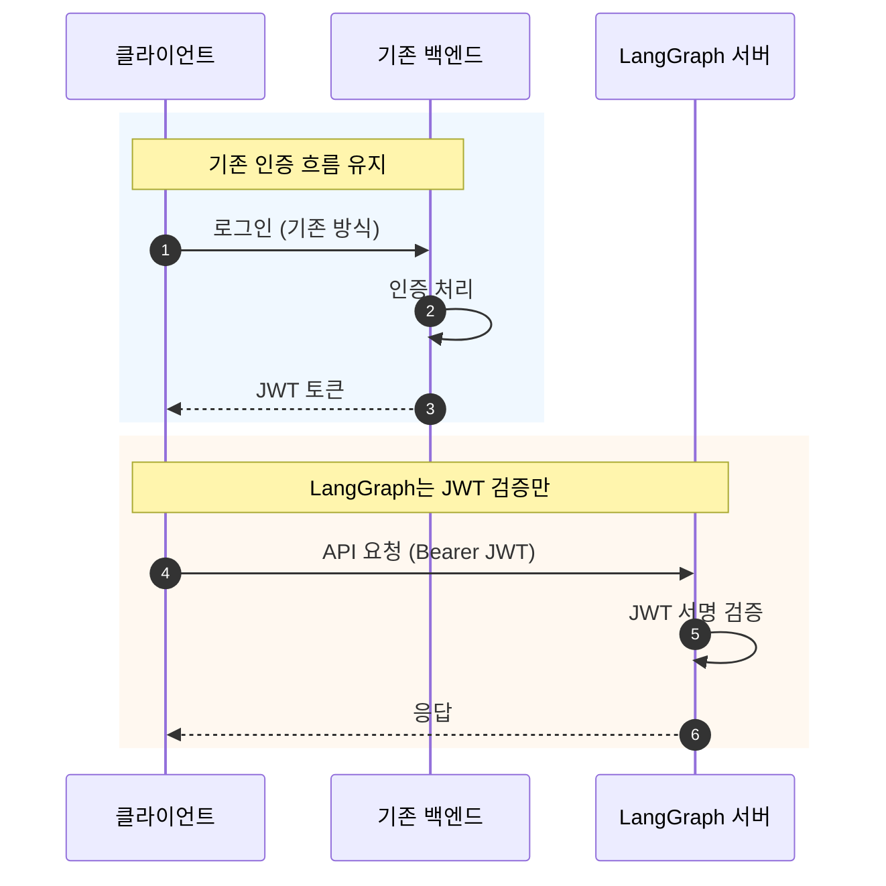
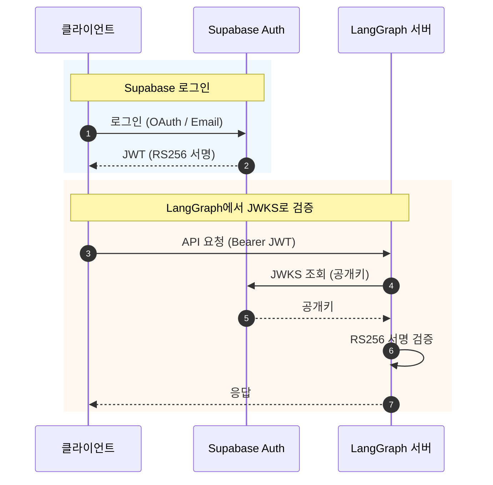

# 기존 인증 시스템 연동

기존 백엔드에 인증 시스템이 있는 경우, LangGraph와 연동하는 방법을 안내합니다.

## 목차

1. [연동 원리](#연동-원리)
2. [Django 연동](#django-연동)
3. [Spring Boot 연동](#spring-boot-연동)
4. [Express.js 연동](#expressjs-연동)
5. [Supabase Auth 연동](#supabase-auth-연동)
6. [Firebase Auth 연동](#firebase-auth-연동)
7. [Keycloak 연동](#keycloak-연동)

---

## 연동 원리



**핵심**: JWT Secret만 공유하면 기존 시스템 변경 없이 연동 가능

---

## Django 연동

### 기존 Django 인증 설정

```python
# settings.py
SIMPLE_JWT = {
    'ALGORITHM': 'HS256',
    'SIGNING_KEY': 'your-jwt-secret-key',  # LangGraph와 공유
    'ACCESS_TOKEN_LIFETIME': timedelta(hours=1),
}
```

### Django JWT 발급 (기존 코드)

```python
# views.py
from rest_framework_simplejwt.tokens import RefreshToken

def login(request):
    user = authenticate(request)
    refresh = RefreshToken.for_user(user)

    # 커스텀 클레임 추가
    refresh['email'] = user.email
    refresh['name'] = user.get_full_name()

    return Response({
        'access_token': str(refresh.access_token),
        'refresh_token': str(refresh),
    })
```

### LangGraph 설정

```python
# src/security/auth.py
import os
import jwt
from langgraph_sdk import Auth

# Django SIGNING_KEY와 동일
JWT_SECRET_KEY = os.environ.get("JWT_SECRET_KEY")
JWT_ALGORITHM = "HS256"

auth = Auth()

@auth.authenticate
async def authenticate(authorization: str | None) -> Auth.types.MinimalUserDict:
    if not authorization:
        raise Auth.exceptions.HTTPException(status_code=401, detail="Unauthorized")

    scheme, _, token = authorization.partition(" ")
    if scheme.lower() != "bearer" or not token:
        raise Auth.exceptions.HTTPException(status_code=401, detail="Invalid token")

    try:
        payload = jwt.decode(token, JWT_SECRET_KEY, algorithms=[JWT_ALGORITHM])
    except jwt.InvalidTokenError:
        raise Auth.exceptions.HTTPException(status_code=401, detail="Invalid token")

    return {
        "identity": payload.get("user_id"),  # Django SimpleJWT 기본값
        "email": payload.get("email", ""),
    }
```

---

## Spring Boot 연동

### 기존 Spring Security 설정

```java
// application.yml
jwt:
  secret: your-jwt-secret-key  # LangGraph와 공유
  expiration: 3600000
```

### Spring JWT 발급 (기존 코드)

```java
// JwtTokenProvider.java
@Component
public class JwtTokenProvider {
    @Value("${jwt.secret}")
    private String secretKey;

    public String createToken(User user) {
        Claims claims = Jwts.claims().setSubject(user.getId().toString());
        claims.put("email", user.getEmail());
        claims.put("name", user.getName());

        Date now = new Date();
        Date validity = new Date(now.getTime() + 3600000);

        return Jwts.builder()
            .setClaims(claims)
            .setIssuedAt(now)
            .setExpiration(validity)
            .signWith(SignatureAlgorithm.HS256, secretKey)
            .compact();
    }
}
```

### LangGraph 설정

```python
# src/security/auth.py
JWT_SECRET_KEY = os.environ.get("JWT_SECRET_KEY")  # Spring jwt.secret과 동일

@auth.authenticate
async def authenticate(authorization: str | None) -> Auth.types.MinimalUserDict:
    # ... 토큰 파싱

    payload = jwt.decode(token, JWT_SECRET_KEY, algorithms=["HS256"])

    return {
        "identity": payload.get("sub"),  # Spring에서 setSubject()로 설정
        "email": payload.get("email", ""),
    }
```

---

## Express.js 연동

### 기존 Express 인증 설정

```javascript
// config.js
module.exports = {
  jwtSecret: "your-jwt-secret-key", // LangGraph와 공유
  jwtExpiration: "1h",
};
```

### Express JWT 발급 (기존 코드)

```javascript
// auth.js
const jwt = require("jsonwebtoken");
const config = require("./config");

function login(req, res) {
  const user = authenticateUser(req.body);

  const token = jwt.sign(
    {
      sub: user.id,
      email: user.email,
      name: user.name,
    },
    config.jwtSecret,
    { expiresIn: config.jwtExpiration },
  );

  res.json({ access_token: token });
}
```

### LangGraph 설정

```python
# src/security/auth.py
JWT_SECRET_KEY = os.environ.get("JWT_SECRET_KEY")  # Express jwtSecret과 동일

@auth.authenticate
async def authenticate(authorization: str | None) -> Auth.types.MinimalUserDict:
    # ... 토큰 파싱

    payload = jwt.decode(token, JWT_SECRET_KEY, algorithms=["HS256"])

    return {
        "identity": payload.get("sub"),
        "email": payload.get("email", ""),
    }
```

---

## Supabase Auth 연동

Supabase는 RS256(비대칭키)를 사용합니다.

### 아키텍처



### LangGraph 설정

```python
# src/security/auth.py
import os
import jwt
import httpx
from langgraph_sdk import Auth

SUPABASE_URL = os.environ.get("SUPABASE_URL")
JWKS_URL = f"{SUPABASE_URL}/auth/v1/.well-known/jwks.json"

auth = Auth()

# JWKS 캐시
_jwks_client = None

def get_jwks_client():
    global _jwks_client
    if _jwks_client is None:
        _jwks_client = jwt.PyJWKClient(JWKS_URL)
    return _jwks_client

@auth.authenticate
async def authenticate(authorization: str | None) -> Auth.types.MinimalUserDict:
    if not authorization:
        raise Auth.exceptions.HTTPException(status_code=401, detail="Unauthorized")

    scheme, _, token = authorization.partition(" ")
    if scheme.lower() != "bearer" or not token:
        raise Auth.exceptions.HTTPException(status_code=401, detail="Invalid token")

    try:
        signing_key = get_jwks_client().get_signing_key_from_jwt(token)
        payload = jwt.decode(
            token,
            signing_key.key,
            algorithms=["RS256"],
            audience="authenticated",
        )
    except jwt.InvalidTokenError:
        raise Auth.exceptions.HTTPException(status_code=401, detail="Invalid token")

    return {
        "identity": payload.get("sub"),
        "email": payload.get("email", ""),
    }
```

### 환경 변수

```env
SUPABASE_URL=https://your-project.supabase.co
```

---

## Firebase Auth 연동

Firebase도 RS256을 사용합니다.

### LangGraph 설정

```python
# src/security/auth.py
import os
import jwt
from langgraph_sdk import Auth

FIREBASE_PROJECT_ID = os.environ.get("FIREBASE_PROJECT_ID")
JWKS_URL = "https://www.googleapis.com/service_accounts/v1/jwk/securetoken@system.gserviceaccount.com"

auth = Auth()

_jwks_client = None

def get_jwks_client():
    global _jwks_client
    if _jwks_client is None:
        _jwks_client = jwt.PyJWKClient(JWKS_URL)
    return _jwks_client

@auth.authenticate
async def authenticate(authorization: str | None) -> Auth.types.MinimalUserDict:
    if not authorization:
        raise Auth.exceptions.HTTPException(status_code=401, detail="Unauthorized")

    scheme, _, token = authorization.partition(" ")
    if scheme.lower() != "bearer" or not token:
        raise Auth.exceptions.HTTPException(status_code=401, detail="Invalid token")

    try:
        signing_key = get_jwks_client().get_signing_key_from_jwt(token)
        payload = jwt.decode(
            token,
            signing_key.key,
            algorithms=["RS256"],
            issuer=f"https://securetoken.google.com/{FIREBASE_PROJECT_ID}",
            audience=FIREBASE_PROJECT_ID,
        )
    except jwt.InvalidTokenError:
        raise Auth.exceptions.HTTPException(status_code=401, detail="Invalid token")

    return {
        "identity": payload.get("user_id"),
        "email": payload.get("email", ""),
    }
```

### 환경 변수

```env
FIREBASE_PROJECT_ID=your-firebase-project-id
```

---

## Keycloak 연동

Keycloak도 RS256과 JWKS를 사용합니다.

### LangGraph 설정

```python
# src/security/auth.py
import os
import jwt
from langgraph_sdk import Auth

KEYCLOAK_URL = os.environ.get("KEYCLOAK_URL")
KEYCLOAK_REALM = os.environ.get("KEYCLOAK_REALM")
JWKS_URL = f"{KEYCLOAK_URL}/realms/{KEYCLOAK_REALM}/protocol/openid-connect/certs"

auth = Auth()

_jwks_client = None

def get_jwks_client():
    global _jwks_client
    if _jwks_client is None:
        _jwks_client = jwt.PyJWKClient(JWKS_URL)
    return _jwks_client

@auth.authenticate
async def authenticate(authorization: str | None) -> Auth.types.MinimalUserDict:
    if not authorization:
        raise Auth.exceptions.HTTPException(status_code=401, detail="Unauthorized")

    scheme, _, token = authorization.partition(" ")
    if scheme.lower() != "bearer" or not token:
        raise Auth.exceptions.HTTPException(status_code=401, detail="Invalid token")

    try:
        signing_key = get_jwks_client().get_signing_key_from_jwt(token)
        payload = jwt.decode(
            token,
            signing_key.key,
            algorithms=["RS256"],
            issuer=f"{KEYCLOAK_URL}/realms/{KEYCLOAK_REALM}",
        )
    except jwt.InvalidTokenError:
        raise Auth.exceptions.HTTPException(status_code=401, detail="Invalid token")

    return {
        "identity": payload.get("sub"),
        "email": payload.get("email", ""),
        "name": payload.get("preferred_username", ""),
    }
```

### 환경 변수

```env
KEYCLOAK_URL=https://keycloak.example.com
KEYCLOAK_REALM=your-realm
```

---

## 체크리스트

### HS256 (대칭키) 연동

- [ ] 기존 시스템의 JWT Secret 확인
- [ ] LangGraph에 동일한 Secret 설정
- [ ] JWT payload 구조 확인 (sub, email 등)

### RS256 (비대칭키) 연동

- [ ] JWKS 엔드포인트 URL 확인
- [ ] issuer, audience 값 확인
- [ ] LangGraph에 JWKS 클라이언트 설정

### 공통

- [ ] 토큰 만료 시간 확인
- [ ] 필요한 클레임(claims) 확인
- [ ] 테스트 환경에서 검증

---

## 다음 단계

- NextAuth 사용: [01-NEXTAUTH-OAUTH.md](./01-NEXTAUTH-OAUTH.ko.md)
- OAuth 토큰 직접 검증: [04-OAUTH-DIRECT.md](./04-OAUTH-DIRECT.ko.md)
