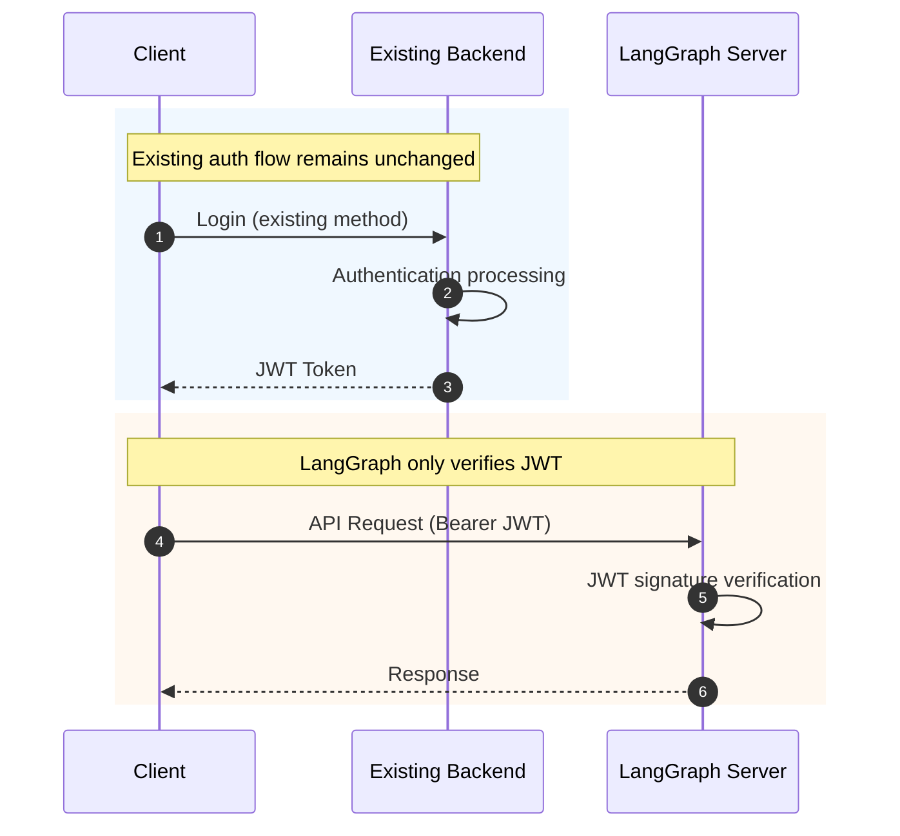
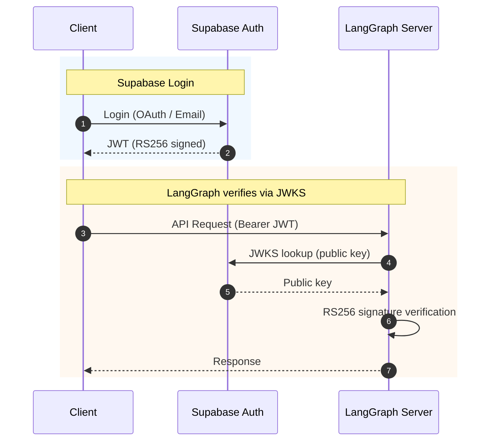

# Integrating with Existing Authentication Systems

This guide explains how to integrate LangGraph with your existing backend authentication system.

## Table of Contents

1. [How Integration Works](#how-integration-works)
2. [Django Integration](#django-integration)
3. [Spring Boot Integration](#spring-boot-integration)
4. [Express.js Integration](#expressjs-integration)
5. [Supabase Auth Integration](#supabase-auth-integration)
6. [Firebase Auth Integration](#firebase-auth-integration)
7. [Keycloak Integration](#keycloak-integration)

---

## How Integration Works



**Key Point**: Integration is possible without modifying existing systems -- just share the JWT Secret

---

## Django Integration

### Existing Django Auth Configuration

```python
# settings.py
SIMPLE_JWT = {
    'ALGORITHM': 'HS256',
    'SIGNING_KEY': 'your-jwt-secret-key',  # Shared with LangGraph
    'ACCESS_TOKEN_LIFETIME': timedelta(hours=1),
}
```

### Django JWT Issuance (Existing Code)

```python
# views.py
from rest_framework_simplejwt.tokens import RefreshToken

def login(request):
    user = authenticate(request)
    refresh = RefreshToken.for_user(user)

    # Add custom claims
    refresh['email'] = user.email
    refresh['name'] = user.get_full_name()

    return Response({
        'access_token': str(refresh.access_token),
        'refresh_token': str(refresh),
    })
```

### LangGraph Configuration

```python
# src/security/auth.py
import os
import jwt
from langgraph_sdk import Auth

# Same as Django SIGNING_KEY
JWT_SECRET_KEY = os.environ.get("JWT_SECRET_KEY")
JWT_ALGORITHM = "HS256"

auth = Auth()

@auth.authenticate
async def authenticate(authorization: str | None) -> Auth.types.MinimalUserDict:
    if not authorization:
        raise Auth.exceptions.HTTPException(status_code=401, detail="Unauthorized")

    scheme, _, token = authorization.partition(" ")
    if scheme.lower() != "bearer" or not token:
        raise Auth.exceptions.HTTPException(status_code=401, detail="Invalid token")

    try:
        payload = jwt.decode(token, JWT_SECRET_KEY, algorithms=[JWT_ALGORITHM])
    except jwt.InvalidTokenError:
        raise Auth.exceptions.HTTPException(status_code=401, detail="Invalid token")

    return {
        "identity": payload.get("user_id"),  # Django SimpleJWT default
        "email": payload.get("email", ""),
    }
```

---

## Spring Boot Integration

### Existing Spring Security Configuration

```java
// application.yml
jwt:
  secret: your-jwt-secret-key  # Shared with LangGraph
  expiration: 3600000
```

### Spring JWT Issuance (Existing Code)

```java
// JwtTokenProvider.java
@Component
public class JwtTokenProvider {
    @Value("${jwt.secret}")
    private String secretKey;

    public String createToken(User user) {
        Claims claims = Jwts.claims().setSubject(user.getId().toString());
        claims.put("email", user.getEmail());
        claims.put("name", user.getName());

        Date now = new Date();
        Date validity = new Date(now.getTime() + 3600000);

        return Jwts.builder()
            .setClaims(claims)
            .setIssuedAt(now)
            .setExpiration(validity)
            .signWith(SignatureAlgorithm.HS256, secretKey)
            .compact();
    }
}
```

### LangGraph Configuration

```python
# src/security/auth.py
JWT_SECRET_KEY = os.environ.get("JWT_SECRET_KEY")  # Same as Spring jwt.secret

@auth.authenticate
async def authenticate(authorization: str | None) -> Auth.types.MinimalUserDict:
    # ... token parsing

    payload = jwt.decode(token, JWT_SECRET_KEY, algorithms=["HS256"])

    return {
        "identity": payload.get("sub"),  # Set via setSubject() in Spring
        "email": payload.get("email", ""),
    }
```

---

## Express.js Integration

### Existing Express Auth Configuration

```javascript
// config.js
module.exports = {
  jwtSecret: "your-jwt-secret-key", // Shared with LangGraph
  jwtExpiration: "1h",
};
```

### Express JWT Issuance (Existing Code)

```javascript
// auth.js
const jwt = require("jsonwebtoken");
const config = require("./config");

function login(req, res) {
  const user = authenticateUser(req.body);

  const token = jwt.sign(
    {
      sub: user.id,
      email: user.email,
      name: user.name,
    },
    config.jwtSecret,
    { expiresIn: config.jwtExpiration },
  );

  res.json({ access_token: token });
}
```

### LangGraph Configuration

```python
# src/security/auth.py
JWT_SECRET_KEY = os.environ.get("JWT_SECRET_KEY")  # Same as Express jwtSecret

@auth.authenticate
async def authenticate(authorization: str | None) -> Auth.types.MinimalUserDict:
    # ... token parsing

    payload = jwt.decode(token, JWT_SECRET_KEY, algorithms=["HS256"])

    return {
        "identity": payload.get("sub"),
        "email": payload.get("email", ""),
    }
```

---

## Supabase Auth Integration

Supabase uses RS256 (asymmetric keys).

### Architecture



### LangGraph Configuration

```python
# src/security/auth.py
import os
import jwt
import httpx
from langgraph_sdk import Auth

SUPABASE_URL = os.environ.get("SUPABASE_URL")
JWKS_URL = f"{SUPABASE_URL}/auth/v1/.well-known/jwks.json"

auth = Auth()

# JWKS cache
_jwks_client = None

def get_jwks_client():
    global _jwks_client
    if _jwks_client is None:
        _jwks_client = jwt.PyJWKClient(JWKS_URL)
    return _jwks_client

@auth.authenticate
async def authenticate(authorization: str | None) -> Auth.types.MinimalUserDict:
    if not authorization:
        raise Auth.exceptions.HTTPException(status_code=401, detail="Unauthorized")

    scheme, _, token = authorization.partition(" ")
    if scheme.lower() != "bearer" or not token:
        raise Auth.exceptions.HTTPException(status_code=401, detail="Invalid token")

    try:
        signing_key = get_jwks_client().get_signing_key_from_jwt(token)
        payload = jwt.decode(
            token,
            signing_key.key,
            algorithms=["RS256"],
            audience="authenticated",
        )
    except jwt.InvalidTokenError:
        raise Auth.exceptions.HTTPException(status_code=401, detail="Invalid token")

    return {
        "identity": payload.get("sub"),
        "email": payload.get("email", ""),
    }
```

### Environment Variables

```env
SUPABASE_URL=https://your-project.supabase.co
```

---

## Firebase Auth Integration

Firebase also uses RS256.

### LangGraph Configuration

```python
# src/security/auth.py
import os
import jwt
from langgraph_sdk import Auth

FIREBASE_PROJECT_ID = os.environ.get("FIREBASE_PROJECT_ID")
JWKS_URL = "https://www.googleapis.com/service_accounts/v1/jwk/securetoken@system.gserviceaccount.com"

auth = Auth()

_jwks_client = None

def get_jwks_client():
    global _jwks_client
    if _jwks_client is None:
        _jwks_client = jwt.PyJWKClient(JWKS_URL)
    return _jwks_client

@auth.authenticate
async def authenticate(authorization: str | None) -> Auth.types.MinimalUserDict:
    if not authorization:
        raise Auth.exceptions.HTTPException(status_code=401, detail="Unauthorized")

    scheme, _, token = authorization.partition(" ")
    if scheme.lower() != "bearer" or not token:
        raise Auth.exceptions.HTTPException(status_code=401, detail="Invalid token")

    try:
        signing_key = get_jwks_client().get_signing_key_from_jwt(token)
        payload = jwt.decode(
            token,
            signing_key.key,
            algorithms=["RS256"],
            issuer=f"https://securetoken.google.com/{FIREBASE_PROJECT_ID}",
            audience=FIREBASE_PROJECT_ID,
        )
    except jwt.InvalidTokenError:
        raise Auth.exceptions.HTTPException(status_code=401, detail="Invalid token")

    return {
        "identity": payload.get("user_id"),
        "email": payload.get("email", ""),
    }
```

### Environment Variables

```env
FIREBASE_PROJECT_ID=your-firebase-project-id
```

---

## Keycloak Integration

Keycloak also uses RS256 and JWKS.

### LangGraph Configuration

```python
# src/security/auth.py
import os
import jwt
from langgraph_sdk import Auth

KEYCLOAK_URL = os.environ.get("KEYCLOAK_URL")
KEYCLOAK_REALM = os.environ.get("KEYCLOAK_REALM")
JWKS_URL = f"{KEYCLOAK_URL}/realms/{KEYCLOAK_REALM}/protocol/openid-connect/certs"

auth = Auth()

_jwks_client = None

def get_jwks_client():
    global _jwks_client
    if _jwks_client is None:
        _jwks_client = jwt.PyJWKClient(JWKS_URL)
    return _jwks_client

@auth.authenticate
async def authenticate(authorization: str | None) -> Auth.types.MinimalUserDict:
    if not authorization:
        raise Auth.exceptions.HTTPException(status_code=401, detail="Unauthorized")

    scheme, _, token = authorization.partition(" ")
    if scheme.lower() != "bearer" or not token:
        raise Auth.exceptions.HTTPException(status_code=401, detail="Invalid token")

    try:
        signing_key = get_jwks_client().get_signing_key_from_jwt(token)
        payload = jwt.decode(
            token,
            signing_key.key,
            algorithms=["RS256"],
            issuer=f"{KEYCLOAK_URL}/realms/{KEYCLOAK_REALM}",
        )
    except jwt.InvalidTokenError:
        raise Auth.exceptions.HTTPException(status_code=401, detail="Invalid token")

    return {
        "identity": payload.get("sub"),
        "email": payload.get("email", ""),
        "name": payload.get("preferred_username", ""),
    }
```

### Environment Variables

```env
KEYCLOAK_URL=https://keycloak.example.com
KEYCLOAK_REALM=your-realm
```

---

## Checklist

### HS256 (Symmetric Key) Integration

- [ ] Confirm the JWT Secret from your existing system
- [ ] Set the same Secret in LangGraph
- [ ] Verify JWT payload structure (sub, email, etc.)

### RS256 (Asymmetric Key) Integration

- [ ] Confirm the JWKS endpoint URL
- [ ] Verify issuer and audience values
- [ ] Configure the JWKS client in LangGraph

### Common

- [ ] Verify token expiration time
- [ ] Confirm required claims
- [ ] Test in a staging environment

---

## Next Steps

- Using NextAuth: [01-NEXTAUTH-OAUTH.md](./01-NEXTAUTH-OAUTH.md)
- Direct OAuth token verification: [04-OAUTH-DIRECT.md](./04-OAUTH-DIRECT.md)
