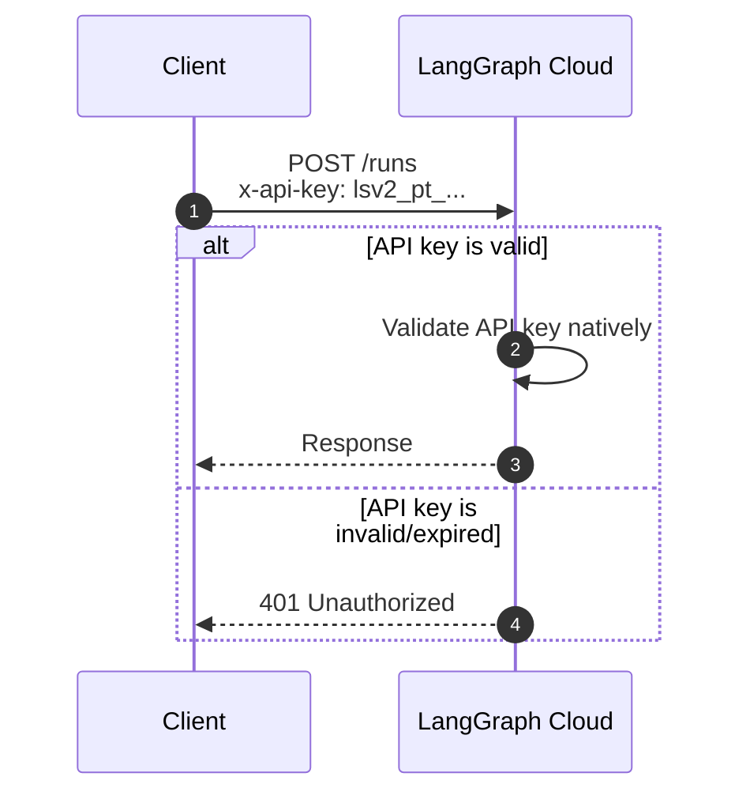

# API Key Authentication (LangGraph Cloud)

This guide explains how to authenticate with LangGraph Cloud using API keys. This is the simplest authentication mode when deploying to LangGraph Cloud.

## Table of Contents

1. [Architecture Overview](#architecture-overview)
2. [Environment Variables](#environment-variables)
3. [Setup](#setup)
4. [Frontend Integration](#frontend-integration)
5. [Client Usage](#client-usage)
6. [Troubleshooting](#troubleshooting)

---

## Architecture Overview



### Key Characteristics

| Item | Description |
|------|-------------|
| **Token Issuer** | LangGraph Cloud |
| **Token Format** | API Key (starts with `lsv2_pt_`) |
| **Token Validation** | LangGraph Cloud validates natively |
| **Frontend** | Optional (auto-login if env var set) |
| **Per-User Isolation** | No (API key represents entire deployment) |
| **Custom Auth Handler** | Not needed |

### Pros and Cons

**Pros:**
- Simplest setup (no `auth.py` needed)
- Works with LangGraph Cloud out of the box
- No token validation logic to implement
- Secure (API keys rotatable in LangGraph Cloud dashboard)

**Cons:**
- API key represents entire deployment (not per-user)
- No per-user thread isolation
- All requests are authenticated equally

---

## Environment Variables

### Frontend (Optional)

```env
NEXT_PUBLIC_AUTH_MODE=api-key
NEXT_PUBLIC_API_URL=http://localhost:2024
NEXT_PUBLIC_LANGCHAIN_API_KEY=lsv2_pt_...
```

If `NEXT_PUBLIC_LANGCHAIN_API_KEY` is set, the UI auto-logs in without requiring user input.

If not set, the UI shows an API key input form.

### Server

No custom environment variables needed. LangGraph Cloud validates API keys natively.

---

## Setup

### Step 1: Generate LangGraph Cloud API Key

1. Login to [LangGraph Cloud](https://cloud.langsmith.com)
2. Navigate to **Settings** → **API Keys**
3. Click **Create API Key**
4. Copy the key (starts with `lsv2_pt_`)
5. Store securely (cannot be retrieved later)

### Step 2: Set Frontend Environment Variable (Optional)

If you want auto-login without a form:

```env
# Frontend .env
NEXT_PUBLIC_AUTH_MODE=api-key
NEXT_PUBLIC_LANGCHAIN_API_KEY=lsv2_pt_...
```

If you omit this, users see an API key input form.

### Step 3: Deploy to LangGraph Cloud

```bash
# Package your LangGraph app
langgraph build

# Deploy (LangGraph Cloud validates API keys automatically)
langgraph push --remote langgraph-api/your-deployment
```

No custom auth handler (`auth.py`) is needed.

---

## Frontend Integration

### Option 1: Auto-Login with Environment Variable

If you set `NEXT_PUBLIC_LANGCHAIN_API_KEY`, the UI automatically logs in:

```env
NEXT_PUBLIC_AUTH_MODE=api-key
NEXT_PUBLIC_LANGCHAIN_API_KEY=lsv2_pt_your_key_here
NEXT_PUBLIC_API_URL=https://your-deployment.dev.langsmith.com
```

The chat UI starts immediately without prompting for credentials.

### Option 2: User-Provided API Key (Form)

If you omit `NEXT_PUBLIC_LANGCHAIN_API_KEY`, users enter their own key:

```env
NEXT_PUBLIC_AUTH_MODE=api-key
NEXT_PUBLIC_API_URL=https://your-deployment.dev.langsmith.com
```

The UI shows an input form where users paste their API key.

### Example Frontend Code

```typescript
// src/lib/auth.ts

import { headers } from "next/headers";

export async function getAuthHeaders(): Promise<Record<string, string>> {
  const authMode = process.env.NEXT_PUBLIC_AUTH_MODE;
  
  if (authMode === "api-key") {
    const apiKey = process.env.NEXT_PUBLIC_LANGCHAIN_API_KEY;
    if (apiKey) {
      return {
        "x-api-key": apiKey,
      };
    }
    // If no env var, user provides it via form
    // Get from localStorage or session
    const storedKey = localStorage.getItem("langchain_api_key");
    if (storedKey) {
      return {
        "x-api-key": storedKey,
      };
    }
  }
  
  return {};
}
```

---

## Client Usage

### Python Client

```python
from langgraph_sdk import get_client

api_key = "lsv2_pt_..."

client = get_client(
    url="https://your-deployment.dev.langsmith.com",
    headers={"x-api-key": api_key}
)

# Create thread
thread = await client.threads.create()

# Stream output
async for event in client.runs.stream(
    thread["thread_id"],
    "agent",
    input={"messages": [{"role": "user", "content": "Hello"}]},
):
    print(event)
```

### JavaScript/TypeScript Client

```typescript
const apiKey = "lsv2_pt_...";

const response = await fetch(
  "https://your-deployment.dev.langsmith.com/threads",
  {
    method: "POST",
    headers: {
      "x-api-key": apiKey,
      "Content-Type": "application/json",
    },
    body: JSON.stringify({}),
  }
);

const thread = await response.json();
console.log(thread.thread_id);
```

### cURL

```bash
API_KEY="lsv2_pt_..."
URL="https://your-deployment.dev.langsmith.com"

# Create thread
curl -X POST "$URL/threads" \
  -H "x-api-key: $API_KEY" \
  -H "Content-Type: application/json" \
  -d '{}' \
  | jq '.thread_id'

# Run agent
curl -X POST "$URL/runs" \
  -H "x-api-key: $API_KEY" \
  -H "Content-Type: application/json" \
  -d '{
    "thread_id": "your-thread-id",
    "assistant_id": "agent",
    "input": {"messages": [{"role": "user", "content": "Hello"}]}
  }'
```

---

## Deployment Configuration

### langgraph.json

No auth configuration needed for API key mode:

```json
{
  "define": "src/graph.py:graph"
}
```

LangGraph Cloud handles API key validation automatically.

### pyproject.toml

```toml
[tool.poetry]
name = "my-langgraph-app"
version = "0.1.0"

[tool.poetry.dependencies]
python = "^3.11"
langgraph = "^0.2.0"
anthropic = "^0.28.0"
```

### No auth.py Required

You do NOT need to create `src/security/auth.py` for API key mode.

---

## Environment Variable Checklist

### Local Development

```env
# .env.local
NEXT_PUBLIC_AUTH_MODE=api-key
NEXT_PUBLIC_API_URL=http://localhost:2024

# Optional: auto-login (for testing)
# NEXT_PUBLIC_LANGCHAIN_API_KEY=lsv2_pt_...
```

### Production (LangGraph Cloud)

```env
# .env.production
NEXT_PUBLIC_AUTH_MODE=api-key
NEXT_PUBLIC_API_URL=https://your-deployment.dev.langsmith.com

# Optional: auto-login for shared deployments
# NEXT_PUBLIC_LANGCHAIN_API_KEY=lsv2_pt_...
```

---

## Comparison with Other Modes

| Mode | Auth Handler | Token Validation | Per-User | Use Case |
|------|--------------|------------------|----------|----------|
| **api-key** | None | Native (LangGraph Cloud) | No | Cloud deployment, shared key |
| **credentials** | Yes (JWT HS256) | Signature verify | Yes | Multi-user, email/password |
| **oauth** | Yes (JWT HS256) | Signature verify | Yes | Multi-user, social login |
| **custom-jwt** | Yes (JWKS) | Public key verify | Yes | External IdP (Auth0, Keycloak) |
| **oauth-direct** | Yes (Provider API) | Provider API call | Yes | CLI/mobile, no frontend |
| **standalone** | None | None | No | Dev/demo, no auth |

---

## Troubleshooting

### Error: "Invalid API key"

**Cause:** API key is malformed or does not exist.

**Solutions:**
1. Verify key format starts with `lsv2_pt_`
2. Check for extra spaces or newlines
3. Regenerate key in LangGraph Cloud dashboard

### Error: "Unauthorized" (401)

**Cause:** API key header is missing or wrong name.

**Solution:** Ensure header is named `x-api-key` (lowercase):
```bash
curl -H "x-api-key: lsv2_pt_..." ...  # Correct
curl -H "X-API-Key: lsv2_pt_..." ...  # Wrong header name
```

### Error: "API key has been revoked"

**Cause:** API key was deleted in LangGraph Cloud dashboard.

**Solution:** Generate a new API key and update environment variables.

### Auto-Login Not Working

**Cause:** `NEXT_PUBLIC_LANGCHAIN_API_KEY` not set or wrong format.

**Solution:**
```bash
echo $NEXT_PUBLIC_LANGCHAIN_API_KEY
# Should show: lsv2_pt_...
```

Verify in `.env` or `.env.local`.

### User Can't Enter API Key

**Cause:** No input form shown (auto-login mode enabled).

**Solution:** Remove `NEXT_PUBLIC_LANGCHAIN_API_KEY` from environment to show the form:
```bash
unset NEXT_PUBLIC_LANGCHAIN_API_KEY
# Restart dev server
npm run dev
```

---

## Best Practices

1. **Rotate API keys regularly** (generate new, delete old in dashboard)
2. **Do not commit API keys** to git (use `.env.local` or secrets manager)
3. **Use different keys per environment** (dev, staging, production)
4. **For multi-user deployments**, use per-user tokens via `custom-jwt` or `oauth` instead
5. **Monitor API key usage** in LangGraph Cloud dashboard

---

## Next Steps

- [Custom JWT Mode](./06-CUSTOM-JWT.md) - for per-user authentication
- [OAuth Direct Mode](./04-OAUTH-DIRECT.md) - for CLI/mobile clients
- [Custom Server Auth](./08-CUSTOM-SERVER-AUTH.md) - for advanced auth patterns
- [LangGraph Cloud Docs](https://docs.smith.langchain.com/)
- Return to [Auth Architecture](./05-AUTH-ARCHITECTURE.md)
